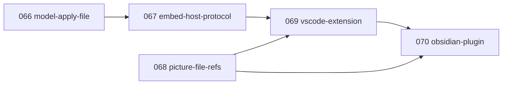

# Backlog 3: editor hosts (066–070)

`docs/backlog.md` (000–038) and `docs/backlog-database.md` (039–049) grew too long, so new
features start here. Same rules: each feature is 1–6 days and goes through `/speckit.specify →
/speckit.plan → /speckit.tasks → /speckit.implement`; **do not start a feature before its
dependencies are merged**; the constitution and `AGENTS.md` apply (Yjs is the source of truth,
`@sododeck/model` is the only Yjs ↔ JSON path, stable ids, heavy work in workers, no network with
content).

- **Status:** draft for founder review (2026-10-07). Not scheduled.
- **Related:** `backlog-database.md` B11 (editor plugins and sync) is covered by this pack for the
  local, single-device case. 065 (local agent bridge, `specs/065-local-agent-bridge/`) shares 066
  as its merge core; see "Relation to 065" below.

## Why

People keep architecture next to the code and notes it describes. A deck that opens inside the
code editor (VS Code) and inside the notes app (Obsidian) as a plain `.sododeck` file can be
committed, diffed, reviewed and written by an AI agent next to the code, then opened as a canvas
with one click. Combined with 027's skill, an agent writes the file and the user sees it drawn.

**Goal of this pack:** one embeddable editor and one host contract, so every host (VS Code now,
Obsidian next, others later) is a thin adapter of a few hundred lines and no editor code is
forked.

## Architecture (proposed)

```
packages/model/          + diffDecks, applyFile(doc, file): merge a changed file into an open doc by id (066)
packages/model/          + `.sododeck.md` form: toMarkdown / fromMarkdown, pure text, no Yjs (070)
packages/host-protocol/  new: messages between the editor and a host, typed + Zod, versioned (067)
apps/app/                + "embed" build: the editor only, storage through the host (067)
apps/app/                + import and export of `.sododeck.md` (070)
apps/vscode/             new: VS Code custom editor adapter (069)
apps/obsidian/           new: Obsidian file view adapter (070)
```

Dependency direction: `app → host-protocol`, `app → model → schema`, `vscode → host-protocol`,
`obsidian → host-protocol`. Host apps never import app code; they copy the embed build, the way the
site copies the skill archive.

- **The file is the store.** In a host there is no IndexedDB library: the workspace or vault folder
  is the library. Yjs stays the source of truth inside the editor; the host owns bytes on disk,
  dirty state, save and backup.
- **The editor sends the whole file, batched** (like `deck-persistence`'s 100 ms write), not Yjs
  updates: hosts store text, and the file must stay readable and diffable.
- **Changes from outside** (git pull, text edit, vault sync, an AI agent writing the file) arrive
  as a whole file and are merged by id into the open doc (066), so selection, viewport and undo
  survive. The merge is **two-way**: the incoming file wins field by field. Editing the same deck
  in the file and on the canvas at the same moment is rare (founder, 2026-10-07); if it happens,
  the user's edits are one undo away (next bullet). Three-way merge is in "Later". The editor
  ignores an incoming file equal to the last one it sent (echo).
- **Undo** stays in the editor (Yjs undo manager) in every host. An outside change is **one undo
  step** ("Changes from file"): the most common outside writer is the user's own AI agent, and its
  change must be easy to take back. The user's own edits before and after stay separate steps, so
  undoing an outside change that overwrote unsaved edits brings those edits back.

### Relation to 065 (local agent bridge)

Both packs solve "the agent and the canvas edit the same deck":

|                                 | Hosts (066–070)                       | 065 local agent bridge                                  |
| ------------------------------- | ------------------------------------- | ------------------------------------------------------- |
| Audience                        | Developers (code editor), notes users | Non-technical users: desktop AI chat app + Sododeck web |
| Shared copy                     | The file on disk                      | The deck in the browser library                         |
| Agent sees the user's selection | No                                    | Yes                                                     |
| Trust surface                   | None new (the host owns the file)     | Pairing, browser permission, Principle IV amendment     |

- **One merge core.** 066 is the model feature both use: 065 drops its own `diffDecks` (065
  research R9) and depends on 066. 065's whole-deck `edit_deck` with `baseRevision` needs the
  three-way merge in "Later"; until then 065 offers change lists only (or a two-way whole-deck
  write).
- **One tool layer, several transports.** 065's agent tools (`get_deck`, `get_selection`,
  `edit_deck`, `check_deck`) are written once; the transport to the editor is either the loopback
  socket (browser, 065) or the host protocol (code editor, "Later: extension as agent bridge").
- **Order:** 066 → 067 / 068 → 069 first (fixes the drift for file-based users with no new trust
  surface), then 065, then 070. 065's gates (ADR 0047, its two dependencies, spike S1) wait until
  then.

### Host contract (067)

| Editor → host                             | Host → editor                                             |
| ----------------------------------------- | --------------------------------------------------------- |
| `ready`                                   | `init { file, theme, capabilities, protocolVersion }`     |
| `change { file }` (batched)               | `external-change { file }`                                |
| `picture-put { id, type, bytes }`         | `picture { id, type, bytes }` or `picture-missing { id }` |
| `picture-get { id }`                      | `theme { scheme }`                                        |
| `open-link { href }`, `export-file { … }` | `flush` (before save or close; answered by `flushed`)     |
| `status { saved / pending / failed }`     |                                                           |

`capabilities` lists what the host can do (open internal links, write sibling files, pick files…);
the editor hides what the host cannot do, as `features.ts` does for browser APIs. A mismatched
`protocolVersion` shows a clear "update the extension" message instead of failing silently.

### Founder decisions (decided 2026-10-07: all three as recommended)

| #   | Question                                   | Decision                                                                                                                                                                                                                                                                                                                                                                    |
| --- | ------------------------------------------ | --------------------------------------------------------------------------------------------------------------------------------------------------------------------------------------------------------------------------------------------------------------------------------------------------------------------------------------------------------------------------- |
| H1  | How the editor runs inside a host          | **An iframe in every host.** VS Code requires a webview (an iframe). In Obsidian, mounting React into its DOM would leak Tailwind's preflight and `:root` tokens and Radix portals into the host's UI.                                                                                                                                                                      |
| H2  | Where pictures live when a file is on disk | **Host decides; file can reference.** Make `assets[id].data` optional and add a relative `path` (068), so a host can keep pictures as sibling files or vault attachments.                                                                                                                                                                                                   |
| H3  | File name in Obsidian                      | **Both, `.sododeck.md` recommended** (amended by the founder, 2026-10-07, in the 070 spec). `.sododeck.md` is a Markdown note (readable text + the full deck as a JSON block) so search, backlinks and picture links that the app rewrites on a move all work; plain `.sododeck` is also registered and opens and edits too. `.sododeck.json` is not supported in Obsidian. |

## Dependency graph



Order: **066 → 067 → 068 → 069 → 070**. 068 can run in parallel with 067.

---

## 066-model-apply-file

- **Status:** implemented (2026-10-07) — see [`spec.md`](../specs/066-model-apply-file/spec.md),
  [`tasks.md`](../specs/066-model-apply-file/tasks.md) and
  [ADR 0047](decisions/0047-apply-file-merge.md). The clarified spec replaces the draft below where
  they differ: the applied change is not undoable (untracked origin), `diffDecks` stays in the skill.
- **Milestone:** after 036 · **Depends on:** none · **Estimate:** 2 d
- **Goal:** A deck file changed outside the editor merges into the open document without losing
  selection, viewport or undo history, and the outside change can be undone in one step.
- **In scope:**
  - `diffDecks(a, b)` in `@sododeck/model`: id-based diff with field values (moved from
    `packages/skill/src/diff.ts`; the skill re-exports it, its output unchanged).
  - `applyFile(doc, file, origin)`: compares the open doc with an incoming `SododeckFile` and
    writes only the differences, matched by stable id (added, removed and changed objects; changed
    fields inside an object; array order where order is meaningful), in one transaction with the
    given origin. Two-way: the incoming file wins field by field.
  - The applied change is **one undo step** in the editor's undo manager, labelled by the caller
    ("Changes from file"); undo restores the document as it was just before the change.
  - An incoming file that fails validation is refused with the problem list; the doc is unchanged.
  - Skill guidance (027): "read the deck file again right before writing it", so an agent rarely
    writes from a stale copy.
- **Out of scope:** three-way merge with a common base ("Later"); conflict UI; hosts (067+); the
  agent bridge (065).
- **Acceptance criteria (draft):**
  - Given an open deck and the same file with one node renamed, When applied, Then only that
    node's title changes, every id is the same and other objects emit no change.
  - Given any fixture deck A and B, When B is applied to a doc of A, Then `toJSON(doc)` equals B
    (round-trip test over the fixture corpus).
  - Given an applied change, When the user presses undo once, Then exactly that change is undone;
    the user's earlier edit is still there and undoes on the next press.
- **Risks:** nested Yjs types (columns, rule rows, flow steps) need per-collection diff rules;
  performance on 500-node decks (bench with `pnpm bench`'s generator).
- **`/speckit.specify` prompt:**
  > Add a way to merge a changed Sododeck file into an already open document. When the deck file is
  > changed outside the editor (another program, a version-control pull, a text edit, the user's AI
  > agent), the open document is updated in place: only objects and fields that differ change,
  > matched by their stable ids, so the user keeps their selection, viewport and undo history. The
  > incoming file wins where it differs. The whole outside change is one undo step. An invalid
  > incoming file is refused with its problems and the document stays as it was. Also tell agents
  > using the AI deck skill to re-read the file right before writing it. Out of scope: three-way
  > merge, conflict UI, any host integration, the agent bridge.

## 067-embed-host-protocol

- **Status:** implemented (2026-10-07) — see [`spec.md`](../specs/067-embed-host-protocol/spec.md),
  [`tasks.md`](../specs/067-embed-host-protocol/tasks.md) and
  [ADR 0049](decisions/0049-embeddable-editor-host-protocol.md). Undo of an outside change follows
  066 (the applied file is not an undo step). The clarified spec replaces the draft below where
  they differ: whole-file messages over a 100 ms window, `blocked` read-only state for invalid
  files, host abilities, no "Saved" state, picture paths written with `setPicturePath`.
- **Milestone:** after 066 · **Depends on:** 066; H1 · **Estimate:** 5 d
- **Goal:** The editor runs inside any host page that speaks one documented protocol, with no
  IndexedDB, library, service worker or telemetry.
- **In scope:**
  - `packages/host-protocol`: message types, Zod schemas, `protocolVersion`, a small bridge helper
    for both sides (`postMessage`), echo detection (last sent file).
  - `apps/app` "embed" entry (separate Vite input): editor route only; `host-persistence` attaches
    to the Yjs doc like `deck-persistence`, sends batched `change`, applies `external-change`
    through 066, answers `flush`; `hostPictureStore` next to `dbPictureStore`.
  - Loader kind `host` next to `demo` / `memory` / `stored`; save status driven by host replies.
  - Theme from the host (light / dark), mapped to the existing tokens.
  - A dev-only fake host page (`/embed-host` in dev builds) that loads a file, shows the messages and
    simulates an outside change; used by component tests as the contract test harness.
  - Package `CLAUDE.md` for `host-protocol`; AGENTS.md repo map and dependency direction updated.
- **Out of scope:** any real host (069, 070); picture file references (068); export through the
  host beyond `export-file`.
- **Acceptance criteria (draft):**
  - Given the fake host with a sample deck, When the user moves a card, Then one `change` arrives
    within 200 ms with the new position and the JSON validates.
  - Given the fake host, When it sends an edited file, Then the canvas updates and no `change` is
    echoed back.
  - Given the embed build, When loaded, Then no request leaves the page (no-third-party check) and
    the bundle has no Dexie, service worker or telemetry code.
  - Given a host with `protocolVersion` 2 and an editor with 1, When loaded, Then the editor shows
    an "update needed" message.
- **Risks:** Web Workers inside a sandboxed iframe (CSP `worker-src`, blob URLs); app modules that
  import storage directly (find them with the embed build's bundle report).
- **`/speckit.specify` prompt:**
  > Make the Sododeck editor embeddable in another program through one documented message protocol.
  > A host page loads the editor in a frame, gives it a deck file, a light or dark theme and a list
  > of what the host can do; the editor sends the changed file back shortly after each edit, asks
  > the host to store and return pictures, and merges files the host reports as changed outside.
  > The embedded editor has no deck library, browser storage, offline cache or telemetry, and sends
  > nothing over the network. Include a development-only fake host to try it and to test the
  > protocol. Out of scope: real editor or notes-app integrations, storing pictures as separate
  > files.

## 068-picture-file-refs

- **Status:** implemented (2026-10-07) — see [`spec.md`](../specs/068-picture-file-refs/spec.md),
  [`tasks.md`](../specs/068-picture-file-refs/tasks.md) and
  [ADR 0048](decisions/0048-picture-file-refs.md).
- **Milestone:** any time · **Depends on:** 055 (pictures); H2 · **Estimate:** 2 d
- **Goal:** A picture in a deck file can point at a file next to it instead of embedding base64, so
  hosts with a folder (workspace, vault) keep decks small and diffable.
- **In scope:**
  - Schema: `Asset.data` optional; new optional `path` (relative to the deck, forward slashes; leading `..` allowed, founder 2026-10-07; hosts refuse paths outside their workspace or vault); exactly one of `data` / `path`. ADR for the format change; Ajv/Zod parity.
  - The web app keeps embedding (`data`); importing a file with `path` pictures shows them as
    missing with a clear reason, never fails the import.
  - Model and skill validator accept both forms; the id rule (SHA-256 of the bytes) is unchanged.
- **Out of scope:** reading sibling files in the web app (no folder access); host behaviour (069,
  070).
- **Acceptance criteria (draft):**
  - Given a file with a `path` picture, When validated, Then it is valid; with both `data` and
    `path`, Then it is invalid with one clear problem.
  - Given every existing fixture, When validated and round-tripped, Then nothing changes.
- **`/speckit.specify` prompt:**
  > Let a picture in a Sododeck file either embed its bytes (as today) or point at an image file
  > relative to the deck file, so editors that keep decks in a folder can store pictures as separate
  > files. Exactly one of the two must be present. Existing files stay valid and unchanged; the web
  > app keeps embedding pictures and shows a pointed-at picture it cannot read as missing, with the
  > reason. Out of scope: reading those files in the web app.

## 069-vscode-extension

- **Status:** implemented 2026-10-07 (code complete, real-editor spikes S1–S3 still to run) · spec `specs/069-vscode-extension/` · ADR `docs/decisions/0050-vscode-extension.md`. **Corrected behaviour:** an outside change on a dirty tab replaces the unsaved edits (the file wins) and undo does _not_ bring them back.
- **Milestone:** after 067 · **Depends on:** 067, 068 · **Estimate:** 5 d
- **Goal:** `.sododeck` files open as a canvas in VS Code, save with the editor's normal save, and
  live in the repo like any file.
- **In scope:**
  - `apps/vscode`: custom editor for `*.sododeck` (and `*.sododeck.json`), "Open as text" for the
    raw JSON; dirty state, save, save as, revert and hot-exit backup through the editor's API.
  - Bridge to the embed build in a webview (strict CSP, local resources only, workers allowed).
  - Outside changes: listen for file changes and send `external-change` (066), ignoring our own
    writes. A change on disk while the tab is dirty is applied like any outside change (the file
    wins, one undo step), never a "file changed on disk" choice; undo brings the unsaved edits
    back.
  - Pictures: setting "embed in file" (default) or "save next to the deck" (068 `path`, folder
    `<deck>.assets/`). Refuse picture paths that resolve outside the workspace (068 FR-014).
  - Theme follows the editor's light / dark theme.
  - Commands: "New Sododeck deck", "Open in Sododeck web" (download only; no upload).
  - Packaging (`vsce`), marketplace README, icon; publishing to the VS Code Marketplace and Open
    VSX is a release step with its own checklist.
- **Out of scope:** multiple editors on one file, a deck library view, telemetry, web VS Code
  (vscode.dev) unless it works without changes.
- **Acceptance criteria (draft):**
  - Given a repo with `docs/arch.sododeck`, When opened, Then the canvas shows and an edit marks the
    tab dirty; save writes valid, pretty-printed JSON.
  - Given the file open, When `git pull` changes it, Then the canvas updates without reloading.
  - Given unsaved moves on the canvas, When an AI agent writes the file on disk, Then the canvas
    shows the file, and one undo brings the moves back.
  - Given the extension running, When the user edits, Then the extension makes no network request.
- **Risks:** webview CSP and workers; large decks over `postMessage` (measure 500 nodes); pretty
  JSON key order must be stable for clean diffs.
- **`/speckit.specify` prompt:**
  > Ship a VS Code extension that opens .sododeck files as the Sododeck canvas. Editing marks the
  > file as changed and the editor's normal save, save as, revert and backup work. If the file
  > changes on disk (for example after a version-control pull) the open canvas updates in place.
  > Pictures are embedded in the file by default, or saved as files next to the deck by a setting.
  > The canvas follows the editor's light or dark theme and nothing is sent over the network. Out
  > of scope: a deck library inside the editor, several canvases on one file, telemetry.

## 070-obsidian-plugin

- **Status:** implemented in code (2026-10-07), real-app checks open — see
  [`spec.md`](../specs/070-obsidian-plugin/spec.md), [`plan.md`](../specs/070-obsidian-plugin/plan.md),
  ADR [0051](decisions/0051-deck-markdown-form.md) and [0052](decisions/0052-obsidian-plugin.md),
  [`apps/obsidian/`](../apps/obsidian/) and the release checklist
  [`docs/release/obsidian-plugin.md`](release/obsidian-plugin.md). Phase A (the Markdown form in the
  model and the web app) and phase B (the plugin) are both built and unit-tested; spikes S1, S3, S4
  and every phone check wait for a real Obsidian (`specs/070-obsidian-plugin/research.md`, "Spike
  results"). The founder changed the scope in the
  clarification: decks in a vault are Markdown notes (`.sododeck.md`); the former "Later" item is
  now part of this feature. The spec and plan replace the draft below where they differ.
- **Milestone:** after 069 · **Depends on:** 066, 067, 068 (069 is the pattern, not a code
  dependency) · **Estimate:** 6–8 d (4 d plugin + 2–4 d Markdown form); the plan marks the split
  point (phase A: Markdown form in the model and the web app, shippable alone; phase B: plugin)
  if one feature is too large.
- **Goal:** decks in an Obsidian vault open as a canvas, on desktop and mobile, and behave like
  vault notes: searchable, linkable, and with pictures that keep working when files move.
- **In scope:**
  - **Markdown form** (`packages/model`, pure text, no Yjs): `.sododeck.md` = front matter marker,
    a readable part (titles and notes with a stable-id marker each, picture link list) and the full
    deck as a hidden JSON block. Titles and notes edited in the text are read back by id (the
    readable text wins). Lossless round trip tested. Web app imports and exports the form.
  - `apps/obsidian`: one file view for `.sododeck.md` notes (detected by the front matter marker,
    view swapped) and for plain `.sododeck` (registered file type); the embed runs in a sandboxed
    iframe (H1), inlined in `main.js`; reads and writes through the vault API; autosave (no manual
    save) within 1 s with `flush` on close and when the app goes to the background.
  - Outside changes (vault sync, another pane, text edit, an AI agent) → `external-change` (066),
    ignoring our own writes.
  - Pictures: new ones go to the vault's attachment location (the app's own setting) and are linked
    from the note by a link the app rewrites on move or rename; one setting keeps them embedded.
    Plain `.sododeck` keeps pictures embedded. Refuse picture paths outside the vault (068 FR-014).
  - Theme follows the app's light / dark class; "New Sododeck" command and folder-menu entry.
  - Release through the community plugin list (manifest, versions file, three release assets).
- **Out of scope:** `.sododeck.json` in Obsidian, conversion commands (the web app converts),
  clicking a `[[link]]` from a card to open a note, a deck preview inside a note, "Open in
  Sododeck web", opening `.sododeck.md` in the code editor (069) or the skill (027) (both "Later").
- **Acceptance criteria:**
  - Given a vault with a `.sododeck.md` or `.sododeck` file, When opened on desktop and mobile,
    Then the canvas shows and edits are in the file within a second.
  - Given a deck note, When the user searches a card title, Then the note is found; When the user
    edits that title in the text, Then the open canvas shows it in place.
  - Given a picture stored by the plugin, When the picture or the deck is moved or renamed in the
    app, Then the picture still shows.
  - Given the same deck changed by vault sync, When the view is open, Then it updates in place.
  - Given the plugin running, When the user edits, Then no network request is made.
- **Risks (spikes S1–S5 in the plan):** swapping the Markdown view for the canvas without a flash;
  the sandboxed iframe, workers and `main.js` size on mobile; the app's save and reload behaviour;
  link rewriting for the picture list.
- **`/speckit.specify` prompt (original; superseded by the spec):**
  > Ship an Obsidian plugin that opens .sododeck files in a vault as the Sododeck canvas, on desktop
  > and mobile. Changes save automatically, a deck changed by sync or in another pane updates in
  > place, pictures go to the vault's attachment folder, and the canvas follows the light or dark
  > theme. Nothing is sent over the network. Out of scope: a Markdown version of the file, links
  > from cards to notes, deck previews inside notes.

---

## 071-shared-vault-decks

- **Status:** in progress (spec: `specs/071-shared-vault-decks/spec.md`; added 2026-10-07, founder request).
- **Milestone:** after 070 · **Depends on:** 069 (VS Code extension), 070 (the `.sododeck.md` form
  and the Obsidian plugin) · **Estimate:** 2–3 d
- **Goal:** one folder of decks that opens as a canvas in both Obsidian and VS Code, with the
  Obsidian-only gains (search by card text, backlinks, pictures that follow moves) kept.
- **In scope (two parts, both built):**
  1. **Cross-tool plain file.** `.sododeck` is the format that already opens in both hosts. Say so
     where users look (the READMEs of both hosts, the web app's export help, `docs/`), and give
     a one-step way to bring `.sododeck.json` files in (rename; a command in each host that
     copies a `.sododeck.json` to a `.sododeck`). No code change to the formats.
  2. **`.sododeck.md` in VS Code.** The extension also opens `*.sododeck.md` as the canvas, when
     the front matter carries the marker (an ordinary Markdown file stays in the text editor, and
     "Open as text" keeps working). Reads through `fromMarkdown`, saves through
     `toMarkdown(deckText, previous)` so text the user wrote outside the owned region survives;
     the readable part is regenerated on save. Pictures: the VS Code host keeps its own picture
     rules (sibling folder, 069); a note's `[[link]]` list is written for Obsidian only when the
     picture is a plain relative path (decision needed, see questions).
- **Out of scope:** the skill (027) writing or checking `.sododeck.md`; Obsidian-style link
  rewriting in VS Code.
- **Acceptance criteria:**
  - Given one folder, When it is opened as an Obsidian vault and as a VS Code workspace, Then a
    `.sododeck` file opens as the canvas in both and an edit in one shows in the other within a second
    (VS Code saves on its normal save).
  - Given a `.sododeck.md` note, When it is opened in VS Code, Then it shows the canvas; When the
    user types a paragraph after the generated region and edits on the canvas, Then the paragraph
    is still there and Obsidian still opens the note as a deck.
  - Given a Markdown file without the marker, When it is opened in VS Code, Then it stays a text file.
  - Given a card title edited as text in the note, When the note is open in VS Code, Then the canvas
    shows it in place.
- **Questions for the founder:** how a picture added in VS Code is stored for a `.sododeck.md`
  (sibling file with a plain relative path that Obsidian resolves, or embedded); whether the new-deck
  command in VS Code creates `.sododeck` or `.sododeck.md`.
- **Spec Kit:** `/speckit.specify` with this section.

---

## Later (not scheduled)

- **Three-way merge for outside changes** (deferred from 066, founder 2026-10-07: editing the
  file and the canvas at the same moment is rare). `applyFile(doc, file, { base })` with the last
  file the editor read or wrote as the base applies only what changed since then and keeps the
  user's unsaved edits; an object removed by one side and edited by the other is kept with the
  edit. Do it when users report lost edits, or when 065 needs whole-deck `edit_deck` with
  `baseRevision`.
- **`.sododeck.md` in other tools:** the skill (027) opens and validates the Markdown form too. (The code-editor extension moved into 071.) (The form itself and its Obsidian use moved into 070, founder 2026-10-07.)
- **`.sododeck.svg`** / **`.sododeck.png`**: an image file that also carries the deck, so it renders
  on code hosts and in Markdown previews and still opens for editing.
- **Links to notes and code:** a card or note links to a vault note or a workspace file and the
  host opens it (`open-link` with an internal target).
- **Deck preview inside a note or Markdown preview** (read-only, one view).
- **Shared shape library as a workspace file** so a team uses the same templates.
- **Extension as agent bridge:** the code-editor extension registers 065's agent tools with the
  editor's built-in AI and other local agents, talking to the open canvas over the host protocol
  instead of the loopback socket, so the agent can also read the selection ("fix this flow") with
  no browser permission or pairing.
- **More hosts:** a desktop wrapper (registers `.sododeck` with the OS, see ADR 0038), other code
  editors that support web views.
