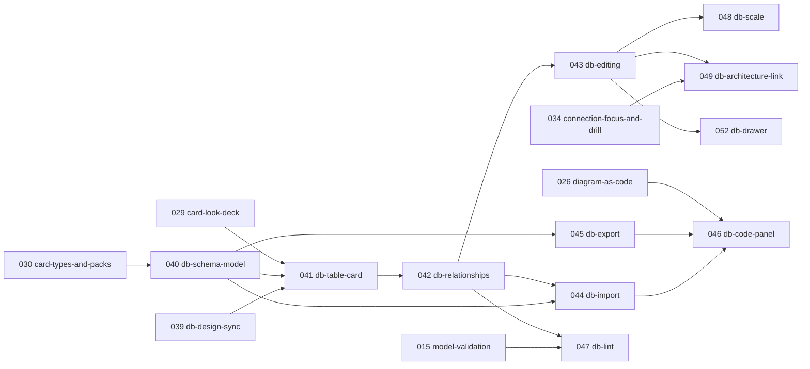

# Database pack backlog (039–049)

The **Database pack** is a new category in Sododeck: tables, columns, keys, relationships, enums
and indexes drawn on the same canvas as the architecture, and read from / written to SQL and
DBML. It is the sixth pack of the type registry from 030 (next to Architecture, Process,
Logistics, Data cards and Basic shapes), not a separate app or deck type.

This file holds every Database pack feature so `docs/backlog.md` stays readable. Same rules as the
main backlog: each feature is 1–6 days and goes through `/speckit.specify → /speckit.plan →
/speckit.tasks → /speckit.implement`; **do not start a feature before its dependencies are
merged**; the constitution and `AGENTS.md` apply (Yjs is the source of truth, `@sododeck/model`
is the only Yjs ↔ JSON path, stable ids, heavy work in workers, no network with content).

- **Status:** draft for founder review (2026-10-03). Not scheduled; picked up after 030.
- **Design:** prompt for the Claude Design board in
  [`design/claude-design-prompt-database-pack.md`](design/claude-design-prompt-database-pack.md).
  Imported by 039 as frames 134–168 (Part A 134–154, Part B 155–168, light and dark) in
  `docs/design/screens/`; inventory in design-analysis §a, tokens in DESIGN.md
  [Database pack](../DESIGN.md#database-pack), decisions in §g-83 onward.
- **Naming rule:** product docs, specs, code and UI copy describe features on their own terms.
  Do not name other diagram or database tools anywhere in the repo.

## Why

People who draw architecture also design the databases behind it, and today they do it in a
separate tool. Sododeck can keep both in one deck: the "Orders DB" card on the architecture board
opens into its tables, a flow step that writes orders points at the `orders` table, and the same
file exports runnable SQL.

**What only Sododeck does (keep it central in every feature):**

1. **Architecture → schema drill-in:** a database card holds its tables (`node.parent`).
2. **Flows touch tables:** a flow step can name the tables or columns it reads or writes, so
   playing "Checkout" lights up `orders` and `payments` inside Orders DB.
3. **One local file:** schema, architecture, flows, rules and notes in one `.sododeck.json`,
   stored in the browser, never sent anywhere.

## Founder decisions (2026-10-03)

| #    | Decision                                                                                                                                                                                                                                                                                                                                                                                                                                                               |
| ---- | ---------------------------------------------------------------------------------------------------------------------------------------------------------------------------------------------------------------------------------------------------------------------------------------------------------------------------------------------------------------------------------------------------------------------------------------------------------------------- |
| DB1  | A **Database pack** inside a normal deck (030), not a separate deck type. A deck with only tables is a "schema deck".                                                                                                                                                                                                                                                                                                                                                  |
| DB2  | Text formats: **SQL DDL** (Postgres, MySQL, SQLite first) and **DBML**, both import and export. DBML is the code-panel format.                                                                                                                                                                                                                                                                                                                                         |
| DB3  | Look: card system direction **B · Deck** only (DESIGN.md "Card system (Deck)"); no new visual direction.                                                                                                                                                                                                                                                                                                                                                               |
| DB4  | Draw the **whole feature at once** in Claude Design (editor screens + components) before splitting the work.                                                                                                                                                                                                                                                                                                                                                           |
| DB5  | Copyright: no code, assets or copy from other tools; we build from the platform, our own design and permissive libraries only.                                                                                                                                                                                                                                                                                                                                         |
| DB6  | Parser (Q1, 2026-10-03): **`@dbml/core`** (Apache-2.0) for DBML and SQL, lazy-loaded inside a Web Worker only when importing, exporting or opening the DBML tab. Needs the dependency approval recorded in 044's ADR. → revised by ADR 0032 (044): `@dbml/parse` for DBML, `node-sql-parser` per dialect for SQL.                                                                                                                                                      |
| DB7  | Storage (Q2): a table is a **node** of type `db.table` (stored as `db-table`, 040) with `columns[]`, so groups, colours, search, views, export, drill-in and flows work for tables as they do for cards.                                                                                                                                                                                                                                                               |
| DB8  | Relationship ends (Q3): a foreign key connector attaches to the **exact column row** at both ends (`edge.fromPort` / `edge.toPort` = column ids; built in 040 as `fromColumns` / `toColumns`, since 022 stores side anchors in `route`).                                                                                                                                                                                                                               |
| DB9  | Long tables (Q5): a table shows up to a limit (**12**, from the design: DESIGN.md [Database pack](../DESIGN.md#database-pack), frame 158) with keys first, then a **"Show all n columns" / "Show fewer"** button at the bottom of the card. The choice is **per table and saved in the deck** (`node.expanded`), so a user can keep some tables fully open. Detail levels (names / keys / all) and semantic zoom still apply on top.                                   |
| DB10 | Many-to-many (Q6): a real `n-n` cardinality can be drawn for quick sketching; SQL export writes the junction table; lint suggests creating one.                                                                                                                                                                                                                                                                                                                        |
| DB11 | Dialect (Q4, revised 2026-10-03): **one dialect per deck**, chosen in **Deck settings** (≡ menu): Generic (default; a small common type list, SQL export asks which dialect), Postgres, MySQL or SQLite; an import sets it from the file. Every table and database card in the deck uses it; a database card only shows it as a chip. Changing it converts column types with a toast listing the conversions and Undo. A different database engine means another deck. |

## Feature inventory

Everything an ER / schema tool is expected to do, mapped to Sododeck. **Status:** ✅ already in
Sododeck (reuse), 🆕 new in this backlog (feature id), ⏳ later (not scheduled), ✖ not planned
(needs a backend, kept in [Needs a backend](#needs-a-backend-later) so it is not forgotten).

### Modelling

| Capability                                                                                                                 | Status                    |
| -------------------------------------------------------------------------------------------------------------------------- | ------------------------- |
| Table: name, schema (namespace), note (Markdown), colour, owner, tags, links                                               | 🆕 040 (+✅ 020)          |
| Column: name, type with size / precision, PK, not null, unique, default (value or expression), auto-increment, check, note | 🆕 040                    |
| Composite primary key                                                                                                      | 🆕 040                    |
| Indexes: single, composite, expression; name; unique; method (btree, hash…)                                                | 🆕 040                    |
| Table-level check constraints with names                                                                                   | 🆕 040                    |
| Relationships: 1–1, 1–n, n–1, n–n; optional / mandatory side; composite; self-reference                                    | 🆕 040, 042               |
| Relationship settings: name, on delete, on update, colour                                                                  | 🆕 040, 042               |
| Enums (schema-scoped, value notes) and enum columns                                                                        | 🆕 040, 043               |
| Schemas / namespaces with cross-schema relationships                                                                       | 🆕 040, 048               |
| Table groups with name, colour, note, collapse                                                                             | ✅ groups (010, 020, 029) |
| Sticky notes on the schema                                                                                                 | ✅ stickies (009)         |
| Custom properties on tables / columns (e.g. owner, PII, retention)                                                         | ⏳ via 032 typed fields   |
| Reusable column sets (e.g. `id`, `created_at`, `updated_at` added to many tables)                                          | ⏳ later                  |
| Sample rows per table (type-checked, CSV out)                                                                              | ⏳ later                  |
| Data lineage: table / column derived from another (pipelines, ETL)                                                         | ⏳ later, via flows       |
| SQL views (base table, joins, output columns)                                                                              | ⏳ later                  |
| Custom / composite types (object-relational)                                                                               | ⏳ later                  |

### Canvas and editing

| Capability                                                                           | Status                                        |
| ------------------------------------------------------------------------------------ | --------------------------------------------- |
| Table card with column rows, key markers, types, nullable                            | 🆕 041                                        |
| Detail levels: names only / keys only / all columns (global, per view, per table)    | 🆕 041, 048                                   |
| Display toggles: data types, nullable, cardinality ends, relationship labels, notes  | 🆕 041                                        |
| Crow's foot ends; connectors attach to the column row                                | 🆕 042                                        |
| Create a relationship by dragging from a column to a column; type-mismatch warning   | 🆕 042                                        |
| Highlight a column's relationships on hover / select                                 | 🆕 042                                        |
| Inline editing of columns (type a line like `email text unique not null`)            | 🆕 043                                        |
| Reorder columns by drag; add / delete with keyboard                                  | 🆕 043                                        |
| Drawer: table, columns, indexes, checks; relationship; enum                          | 🆕 043                                        |
| Type picker per dialect                                                              | 🆕 043                                        |
| Duplicate, copy / paste tables (new ids), multi-select, lock a table                 | 🆕 043 (+✅ 016)                              |
| Auto-connect foreign keys by naming convention (`customer_id` → `customers.id`)      | 🆕 044                                        |
| Auto-layout                                                                          | ✅ ELK (011)                                  |
| Snap to grid, minimap, fit, zoom, undo / redo, multi-tab sync                        | ✅                                            |
| Search tables and columns (Jump to)                                                  | 🆕 048 (+✅ 009)                              |
| Saved views filtered by schema / group / table, keeping positions and collapse state | 🆕 048 (+✅ 011)                              |
| Large tables (row limit, "+n columns", in-table search)                              | 🆕 048                                        |
| Presentation (full screen, read-only, step through views)                            | ✅ views + flow playback; ⏳ a dedicated mode |
| Problems / lint on the schema; block or warn on SQL export                           | 🆕 047 (+✅ 015)                              |

### Import and export

| Capability                                                                        | Status                                               |
| --------------------------------------------------------------------------------- | ---------------------------------------------------- |
| Import SQL DDL: Postgres, MySQL, SQLite                                           | 🆕 044                                               |
| Import SQL DDL: MariaDB, SQL Server, Oracle                                       | ⏳ later                                             |
| Import DBML                                                                       | 🆕 044                                               |
| Import report (mapped, skipped with reasons) and auto-layout of imported tables   | 🆕 044                                               |
| Export SQL DDL per dialect (copy / download)                                      | 🆕 045                                               |
| Export DBML                                                                       | 🆕 045                                               |
| Export Mermaid `erDiagram`                                                        | 🆕 045                                               |
| Export a data dictionary (Markdown: tables, columns, types, notes, relationships) | 🆕 045                                               |
| Export PNG / SVG / PDF, copy as image, deck JSON                                  | ✅ 012                                               |
| Two-way DBML code panel (edit text ↔ canvas)                                      | 🆕 046                                               |
| Starter samples / templates ("Shop", "SaaS auth", "Blog")                         | 🆕 049 (+✅ 013)                                     |
| AI-generated schema                                                               | ✅ via 027 skill (user's own AI, imported as a file) |
| Migrations: diff two versions and write `ALTER` SQL                               | ⏳ later                                             |
| Import from a live database connection                                            | ✖ backend B4; ⏳ a local CLI that writes SQL / DBML  |
| Version history / timeline                                                        | ⏳ later (local snapshots)                           |
| Share link, embed, password, real-time collaboration across people, public API    | ✖ backend B1–B3, B5–B7                               |

## Dependency graph



Order: **039 → 040 → 041 → 042 → 043 → 052 → 044 → 045 → 047 → 048 → 049 → 046** (046 waits for
026).

---

## 039-db-design-sync

- **Milestone:** after 030 · **Depends on:** the Claude Design board (prompt above) · **Estimate:**
  1 d
- **Goal:** The Database pack design is in the repo as the reference for 040–049, like 028 did for
  the card system.
- **In scope:** read-only copies of `Sododeck Database.dc.html` and `sododeck-db.js` in
  `docs/design/claude-design/`; screenshots of every Part A screen and Part B row, light and dark,
  continuing the frame numbers after 127; design-analysis §a entries and §g notes for each
  mismatch with DESIGN.md or the decisions above; a DESIGN.md "Database pack" section with the new
  tokens (table width, column row height, row limit, key glyphs, crow's foot geometry, row
  separator).
- **Out of scope:** code.
- **Known design deviations (founder, 2026-10-03: not fixed in the design; the app wins, fix
  while implementing).** Record each one as a §g note when importing the frames:
  - **≡ menu:** the app's shortcuts (Show JSON ⌘J, Keyboard shortcuts ?) and icons
    (`deck-menu.tsx`) win over the frame, which drops the shortcuts and uses other icons.
  - **Dialect convert confirm (S3):** the existing confirm dialog with the single standard overlay;
    the frame adds a second dim layer.
  - **Deck drawer, existing sections:** Problems, Summary and Storage stay as `DeckInspector`
    draws them today (full problems list, 2×2 summary tiles with a neutral Rules tile, Storage
    with "Export .sododeck.json"); only the **Database** section is new (043).
  - **Toggle / checkbox / segmented controls:** the board draws local copies; use the app's
    `packages/ui` components and tokens (the frame's toggle hard-codes `#fff` and an rgba knob
    shadow).
- **Acceptance criteria:** every screen and row has a light and dark screenshot; DESIGN.md names
  every token 041–043 use; the row limit (DB9) has a proposed value.

## 040-db-schema-model

- **Status:** built (spec `specs/040-db-schema-model`, ADR 0029). Relationship ends are
  `fromColumns` / `toColumns`; enums are a root `enums` list that columns name with `enumRef`.
- **Milestone:** after 030 · **Depends on:** 030 (type registry), 036 (model writes) · **Estimate:**
  4 d
- **Goal:** The file format and the Yjs model can hold a database schema losslessly.
- **In scope:**
  - Database pack in the registry: type `db-table` (040 clarify: no dots in type ids; today's `database`
    type stays and holds the tables) and a deck-level `dialect` (`generic | postgres | mysql | sqlite`, default
    `generic`, DB11).
  - Schema v1 additions, all **optional and additive** (ADR "Database pack model"):
    - on a table node: `schema?`, `columns[]`, `indexes[]`, `checks[]`, `expanded?` (DB9),
      `detail?: 'names' | 'keys' | 'all'`;
    - column: `{ id, name, type, size?, pk?, notNull?, unique?, default?, defaultExpr?,
increment?, check?, note?, enumRef? }` (`enumRef` names an enum of the root `enums` list);
    - index: `{ id, name?, columns: (columnId | { expr })[], unique?, method?, note? }`;
    - check: `{ id, name?, expr }`;
    - enum (root `enums` list, not a card; 040 clarify 2026-10-04): `{ id, name, schema?, note?,
values: { id, name, note? }[] }`;
    - edge: `fromColumns?`, `toColumns?` (non-empty column id lists, paired by position; one item
      for a simple key),
      `cardinality?: '1-1' | '1-n' | 'n-1' | 'n-n'`, `fromOptional?`, `toOptional?`,
      `onDelete?`, `onUpdate?` (`cascade | restrict | set-null | set-default | no-action`).
  - Every reference is by id (constitution III): renaming a column never breaks an index, a
    foreign key or an enum column.
  - `@sododeck/model`: Yjs mapping, round-trip cases (composite key, self-reference, enum,
    expression index, n–n), Ajv / Zod parity.
- **Out of scope:** rendering (041), SQL types per dialect (043 holds the type lists), views,
  custom types, sample rows.
- **Acceptance criteria (draft):**
  - Given a deck with the "Shop" schema, When exported and imported, Then the JSON is identical
    (round-trip test).
  - Given a column renamed from `customer_id` to `buyer_id`, When the JSON is read, Then every
    index, foreign key and column end still points at the same column id.
  - Given a deck saved before 040, When opened and saved, Then no new field appears.
- **Risks:** deep nested arrays in Yjs (columns inside a node) need fine-grained Y types so two
  tabs editing two columns merge; schema size on 150-table decks (bench in 048).
- **`/speckit.specify` prompt:**
  > Add the Database pack data model to Sododeck: tables (as cards of type db-table) with
  > columns, indexes, check constraints and an optional schema name; enums; relationships as
  > connectors that attach to columns, with cardinality (1-1, 1-n, n-1, n-n), optional sides,
  > composite keys and on delete / on update actions. Every column, index, check, enum and enum
  > value has a stable id and all references use ids, so renames never break anything. All new
  > fields are optional; older decks stay valid and unchanged. Out of scope: rendering, SQL
  > import/export, views, custom types, sample data.

## 041-db-table-card

- **Status:** built (spec `specs/041-db-table-card`, ADR 0030). PDF export does not exist yet; the
  relationship display toggles are 042's.
- **Milestone:** after 040 · **Depends on:** 039, 040, 029 · **Estimate:** 5 d
- **Goal:** Tables draw as B-style table cards that stay readable from one table to a dense board.
- **In scope:**
  - Table card (design rows 2, 3, 7): header (table tile, schema name, badges), one-line title,
    optional note, **fixed-height column rows** (key marker, name, type in Mono, nullable),
    indexes footer; colour from the palette; height computed, never measured (§g-58).
  - Column order on the card: the stored order (041 clarify 2026-10-04); import and new columns
    put keys first.
  - Format additions (041 clarify): optional enum colour; deck-level detail and display toggles
    stored in the deck.
  - Detail levels: names only / keys only / all, per table (header toggle, context menu) and per
    deck; semantic zoom maps on top (Landscape icon, System names + key dots, Container keys,
    Component all).
  - Display toggles in deck settings: data types, nullable, cardinality ends, relationship
    labels, notes.
  - Enum columns: hovering the type chip shows the enum's values (enums are a deck-level list, not
    cards; 040 clarify 2026-10-04).
  - Export (012) draws table cards in PNG / SVG / PDF.
  - Model (040): read columns, indexes and checks from the node; relationship ends are the edge's
    `fromColumns` / `toColumns`; enum values come from the root `enums` list via `enumRef`.
- **Out of scope:** connectors to columns (042), editing (043), the row limit for long tables
  (048).
- **Acceptance criteria (draft):** a 12-column table renders with fixed row heights at every zoom
  without changing size; "keys only" shows PK and FK rows and a "+n columns" pill; SVG export
  matches the canvas; `pnpm bench` with 150 tables has no regression vs the same number of
  cards.
- **Risks:** column rows multiply DOM nodes (150 tables × 12 rows); keep rows plain and consider
  023's Canvas renderer for dense schemas.

## 042-db-relationships

- **Status:** built (spec `specs/042-db-relationships`, ADR 0029 amendment). Owns the relationship
  display settings (root `relationshipDisplay`: cardinality ends, labels, notation; clarify
  2026-10-04). Reconnect plugs into today's route handles; 050 should keep the column-end drag.
- **Milestone:** after 041 · **Depends on:** 041, 017 (routing), 029 (line types) · **Estimate:**
  5 d
- **Goal:** Relationships connect columns, show cardinality in crow's foot notation, and are created
  by dragging.
- **In scope:**
  - Ports: each column row has a handle on the left and right; a connector leaves from the side
    facing the other table, at the row's centre; composite keys mark every involved row. The
    model stores the column ends as `fromColumns` / `toColumns` (040), paired by position.
  - Crow's foot ends: one, zero-or-one, one-or-many, zero-or-many, in B's 2px stroke; curved,
    elbow and straight lines (029).
  - Create by drag from a column to a column (target row highlighted); dropping on a
    different type shows a warning chip but still connects (lint in 047).
  - Self-reference loop; two foreign keys between the same tables (bundle or parallel, per
    design); optional label (`ON DELETE CASCADE`) on hover / selection; relationship colour.
  - Hover / select a column: its relationships, the rows at the other ends and the tables stay
    lit, the rest dims (reuse 034's focus).
  - Hidden column (keys-only, row limit, System zoom): the connector anchors on the table edge
    or the "+n" pill.
- **Out of scope:** editing relationship settings (043), lineage.
- **Acceptance criteria (draft):** dragging `orders.customer_id` onto `customers.id` creates an
  n–1 relationship with a crow's foot at `orders`; collapsing `orders` to keys keeps the line on
  the same row; one ⌘Z removes it.

## 043-db-editing

- **Status:** split at `/speckit.specify` (2026-10-04). **Canvas editing built** (spec
  `specs/043-db-editing`): column line editor, row keys, reorder, delete with Undo, row / table /
  relationship menus and quick settings, add / duplicate / paste tables, lock (`Node.locked`, ADR
  0029 amendment), multi-select, Add flyout Database tab. The drawer half moved to
  [052-db-drawer](#052-db-drawer).
- **Milestone:** after 042 · **Depends on:** 042, 019 (quick edit), 016 · **Estimate:** 6 d (split
  at `/speckit.specify`: canvas editing, then drawer)
- **Goal:** Users build and change a schema on the canvas without touching code.
- **In scope:**
  - Add a column by typing a line: `status order_status not null default 'pending'` is parsed into
    name, type, flags and default as you type; ⏎ adds the next row; Esc cancels. Rename in place
    (looks exactly like the shown row). Reorder by drag. ↑ ↓ ⏎ ⌫ keyboard. Delete with Undo toast.
  - Drawer tabs: **Table** (name, schema, colour, note, owner, tags, links), **Columns** (all
    column settings, type picker for the deck's dialect (DB11) with size / precision, enum picker),
    **Indexes** (columns as chips, expression, unique, method, name), **Checks**;
    **Relationship** drawer (from / to columns, cardinality picker drawn with the ends, optional
    sides, on delete / on update, name, colour); **Enum** editor (values with notes, reorder,
    used-by list).
  - Type lists per dialect (Generic, Postgres, MySQL, SQLite) as data in the app, plus the type
    conversion table used when the deck's dialect changes (toast with the conversions + Undo).
  - Deck settings (≡ menu → the details drawer in deck mode, `DeckInspector`, frame 10) gains a **Database** section: dialect and block SQL export
    with errors. (041 built the table switches and 042 the relationship ones: cardinality ends,
    labels, notation; clarify 2026-10-04.)
  - Duplicate a table, copy / paste across decks (new ids, relationships to tables outside the
    paste dropped with a toast), lock a table, multi-selection edits in one undo step.
  - Add flyout: Database tab (Table T, Enum, Note, Table group); packs list shows Database.
- **Out of scope:** SQL / DBML text (044–046), custom types, views.
- **Acceptance criteria (draft):** typing `email text unique not null` and ⏎ adds a unique,
  not-null `email` column; renaming a column keeps its relationships and indexes; every change is
  one ⌘Z.

## 052-db-drawer

- **Milestone:** after 043 · **Depends on:** 043, 018 (details drawer) · **Estimate:** 4 d
- **Goal:** Every table, relationship and enum setting has an editing surface, and column types
  follow the deck's dialect.
- **In scope:**
  - Drawer tabs for a table: **General** (name, schema, colour, note, owner, tags, links),
    **Columns** (all column settings, type picker for the deck's dialect with size / precision,
    enum picker), **Indexes** (columns as chips, expression, unique, method, name), **Checks**.
  - **Relationship** drawer: from / to columns as lists (composite ends), cardinality drawn with
    the ends, optional sides, on delete / on update, name, colour.
  - **Enum** editor (values with notes, reorder, used-by list), the Add flyout's **Enum** tile and
    the canvas menu's "Add enum".
  - Type lists per dialect (Generic, Postgres, MySQL, SQLite) as data in the app, and the type
    conversion table used when the deck's dialect changes (toast with the conversions + Undo).
  - Deck settings **Database** section: dialect select, block SQL export with errors.
- **Out of scope:** SQL / DBML text (044–046), lint (047), custom types, views.
- **Acceptance criteria (draft):** "Edit details" on a table opens its General tab; changing a
  column's type in the Columns tab is one ⌘Z; switching the dialect from Postgres to MySQL shows
  the converted types in a toast with Undo; an enum value added in the editor shows on the enum
  chip's popover.
- **Prompt:**

  ```text
  /speckit.specify 052 from docs/backlog-database.md: the details drawer for the Database pack.
  Table tabs (General, Columns with the dialect type picker and enum picker, Indexes, Checks), the
  relationship drawer (composite column ends, cardinality, optional sides, on delete / on update,
  name, colour), the enum editor with the Enum tile and "Add enum", dialect type lists and
  conversion with an Undo toast, and the Deck settings Database section (dialect, block SQL export
  with errors). Builds on 043's canvas editing (specs/043-db-editing); every edit is one undo step.
  ```

## 044-db-import

- **Milestone:** after 042 · **Depends on:** 040, 042; DB6 (parser) · **Estimate:** 5 d
- **Goal:** An existing schema becomes a laid-out diagram in seconds.
- **In scope:**
  - Import dialog (canvas empty state, Add flyout footer, File menu): paste text or drop `.sql` /
    `.dbml`; dialect Postgres / MySQL / SQLite / auto (an empty Generic deck takes the detected
    dialect; a deck with another dialect asks to convert); preview counts; import into the current
    deck (inside the selected database card if any) or a new deck.
  - Parsing and mapping in a **Web Worker**, parser lazy-loaded; positions from the ELK worker,
    grouped by schema.
  - Supported: tables, columns, all column settings, composite PK, indexes, checks, foreign keys
    (inline and `ALTER TABLE … ADD CONSTRAINT`), enums (`CREATE TYPE … AS ENUM`, MySQL inline
    `ENUM(...)`), schemas, comments → notes. DBML: tables, refs (all forms), enums, table groups →
    groups, notes, header colour → card colour, sticky notes → stickies.
  - Import report: mapped counts, skipped statements with line numbers and reasons (views,
    functions, triggers, grants, partitions…).
  - Optional "Detect foreign keys by name" (`customer_id` → `customers.id`) for schemas without
    constraints, shown as suggestions the user accepts.
  - Stable ids generated once at import; re-import (046) matches by name.
- **Out of scope:** MariaDB / SQL Server / Oracle (later), live database connection, views.
- **Acceptance criteria (draft):** a 30-table Postgres dump imports with every FK as a
  relationship and no overlapping tables; a `CREATE VIEW` shows in the report as skipped; no
  network request is made (e2e no-third-party check stays green).
- **Risks:** parser bundle size (lazy chunk, measured in the report); dialect edge cases (quoted
  identifiers, schemas, comments) need a fixture corpus in `apps/app/src/db/fixtures`.
- **From 045:** pin a DBML parser that reads `?` optional markers and `checks`; add the DBML
  round-trip test using 045's writer (`schemaExport`, "Shop" fixture in
  `apps/app/src/db/fixtures/shop.ts`).

## 045-db-export

- **Status:** built (`specs/045-db-export`, ADR 0031). Writers in `apps/app/src/db/export`; the
  Postgres and SQLite output runs on in-process engines in tests; MySQL by golden file.
- **Milestone:** after 044 · **Depends on:** 040 · **Estimate:** 4 d
- **Goal:** The schema leaves Sododeck as runnable SQL and as text other tools read.
- **In scope:** export menu entries and a preview with Copy / Download for: SQL DDL (Postgres,
  MySQL, SQLite; order tables so foreign keys resolve, or add constraints after), DBML, Mermaid
  `erDiagram`, Markdown data dictionary (per table: columns, types, keys, notes; relationships
  list); selection or whole schema or one database card; n–n writes a junction table; lint
  errors (047) warn before export.
- **Out of scope:** migrations, other dialects, HTML docs site.
- **Acceptance criteria (draft):** Postgres SQL exported from "Shop" runs on a clean Postgres 16
  (test fixture executed in CI with an in-process SQL check, or a golden file); exporting DBML
  then importing it gives the same schema (round-trip test).

## 046-db-code-panel

- **Milestone:** after 026 · **Depends on:** 026 (editable code panel), 044, 045 · **Estimate:** 5 d
- **Goal:** Developers write the schema as DBML and see the diagram follow, or edit the diagram and
  see the text follow.
- **In scope:** a **DBML** tab in the code overlay (selection / whole schema); edits apply after a
  short pause through a **parse → match → plan → apply** pipeline in `@sododeck/model`:
  parsed tables and columns are matched to existing ones by id-preserving rules (same name, then
  case-insensitive name, then a likely rename), the plan is a list of add / update / remove
  operations applied in one Yjs transaction (one ⌘Z), positions and colours are kept; parse
  errors show inline and never touch the document.
- **Out of scope:** SQL as an editable tab (read-only preview only).
- **Acceptance criteria (draft):** renaming a table in DBML keeps its position, colour and
  relationships; an invalid line shows an inline error and the canvas does not change; typing in
  one tab updates the canvas in another tab.

## 047-db-lint

- **Milestone:** after 042 · **Depends on:** 015, 042 · **Estimate:** 2 d
- **Goal:** Schema mistakes show up in the problems list before they reach SQL.
- **In scope:** rules as pure functions: table without PK; duplicate table / column / index /
  enum name; empty column name or type; FK type mismatch; FK to a missing column; FK not
  referencing a PK or unique column; n–n without a junction table; enum without values; default
  that does not match the type; not-null column with a null default; circular required FKs;
  duplicate relationship. Clicking a problem selects the table and the row; a deck setting
  "Block SQL export with errors".
- **Acceptance criteria (draft):** "Shop" with `payments.id` removed shows "payments has no
  primary key" and the export warns.

## 048-db-scale

- **Milestone:** after 043 · **Depends on:** 043, 011 (views), 037 (bench) · **Estimate:** 4 d
- **Goal:** A 60-column table and a 150-table schema stay usable.
- **In scope:**
  - Row limit (DB9, 12, see DESIGN.md [Database pack](../DESIGN.md#database-pack)): keys first, then "Show all n columns" / "Show fewer" at the bottom of the
    card, saved per table (`node.expanded`); rows with relationships always shown even when cut;
    a relationship end on a hidden column moves its anchor from 042's "+n columns" pill to the
    "Show all" button;
    no scrolling inside a card; in-table column filter.
  - Schemas as groups; group collapse with merged ×n connectors listing the FKs they carry.
  - Saved views filtered by schema / group / table, keeping positions, collapse state and
    detail level.
  - Jump to (⌘K) by table and column; focus a table and its one-hop neighbours.
  - Bench: 150 tables / 1,800 columns / 250 relationships added to `pnpm bench`
    (`BENCH_TABLES` from 041 builds the tables).
  - The row limit plugs into 041's `tableLayout` (`table-layout.ts`): it decides the kept rows,
    the cut count and the height for the canvas, connectors and export at once.
- **Acceptance criteria (draft):** the 150-table fixture pans at the same FPS target as 500
  cards; Jump to "invoice_id" selects the column row and pans to it.

## 049-db-architecture-link

- **Milestone:** after 043 · **Depends on:** 034 (drill-in, outside proxies), 043, 007 (flows) ·
  **Estimate:** 4 d
- **Goal:** The schema and the architecture are one model.
- **In scope:**
  - A database card shows "n tables inside"; Enter opens "Inside Orders DB"; tables created inside
    get `parent` = the card; foreign keys to tables in another database card show as dashed
    outside proxies.
  - The deck's dialect (DB11) shows as a chip on every database card; "Export SQL" from a
    database card writes its tables only, in the deck's dialect (Generic asks which one).
  - **Flow playback touching tables** (founder, 2026-10-03: architecture flows only, no flows
    drawn between tables for now): a flow step can list the tables (and optionally columns) it
    reads or writes. At architecture level the database card shows a "writes orders +1" chip on
    the current step. Drilled into the database, **every** table the step touches is lit as the
    current step, the touched column rows are highlighted (reads vs writes readable without
    colour), and the step player and flow chip stay on screen so the user can keep stepping
    inside the database.
  - Samples (013): "Shop" (architecture + schema + Checkout flow), "SaaS auth", "Blog".
- **Acceptance criteria (draft):** playing "Checkout" with a step "Create order → writes orders"
  highlights `orders` when drilled into Orders DB; moving a table to another database card turns
  its cross-database FKs into outside proxies.

---

## Later (not scheduled)

- **Sample rows** per table: a few typed example rows, shown in a popover from the table header,
  CSV out, excluded from SQL by default.
- **Lineage:** "derived from" links between tables or columns (pipelines, ETL, materialised
  tables), drawn in their own line style; clicking a column traces its upstream and downstream.
  Likely built on flows rather than a new object.
- **SQL views** (base table, joins, output columns) and **custom / composite types**.
- **Reusable column sets** (e.g. `timestamps`, `soft_delete`) inserted into many tables and kept in
  sync.
- **Migrations:** compare two saved versions and write `ALTER` SQL; needs local version snapshots.
- **More dialects:** MariaDB, SQL Server, Oracle (import and export).
- **Local CLI** that reads a live database and writes SQL / DBML for import (the app itself never
  connects to a database).
- **Presentation mode:** full screen, read-only, step through saved views.

## Needs a backend (later)

Not possible in the local-first MVP (no login, no server, constitution IV: no diagram content over
the network). Recorded here so they are planned when Sododeck gets a backend. Each one needs its own
ADR on privacy (content leaves the browser only when the user asks), auth and storage.

| #   | Feature                      | What it is                                                                                                                                                            | Notes for later                                                                                                                                           |
| --- | ---------------------------- | --------------------------------------------------------------------------------------------------------------------------------------------------------------------- | --------------------------------------------------------------------------------------------------------------------------------------------------------- |
| B1  | Share link                   | A URL that opens a deck (view, comment or edit), with permissions per person or "anyone with the link".                                                               | Needs accounts and server storage of the deck. Read-only links first.                                                                                     |
| B2  | Password-protected link      | A shared link that asks for a password.                                                                                                                               | On top of B1.                                                                                                                                             |
| B3  | Embed                        | An `<iframe>` / script that shows a live, read-only deck or one view inside docs, wikis or Notion-style pages, updating when the deck changes.                        | On top of B1; needs a public read endpoint and a small viewer bundle.                                                                                     |
| B4  | Import from a live database  | Connect to Postgres / MySQL / SQL Server with credentials and read the schema (tables, columns, keys, indexes, comments), then refresh it later and see what changed. | The browser cannot open a database connection. Either a server connector (credentials stored securely) or the local CLI from "Later" (no backend needed). |
| B5  | Real-time collaboration      | Several people editing the same deck at once with cursors and presence.                                                                                               | 036 already makes the Yjs model collab-ready; needs a sync server (y-websocket or similar), auth and persistence.                                         |
| B6  | Public API                   | Read and write decks and schemas over HTTP (e.g. push a schema from CI after a migration).                                                                            | Needs B1's server storage and API tokens.                                                                                                                 |
| B7  | Hosted schema documentation  | A generated, searchable docs site for a schema (tables, columns, notes, relationships), kept up to date from the deck or from CI, with access control.                | The Markdown data dictionary (045) is the local version.                                                                                                  |
| B8  | Version history in the cloud | Named versions of a deck kept on the server, compare two versions, restore one, and write migration SQL between them.                                                 | Local snapshots ("Later") can come first; cloud versions on top of B1.                                                                                    |
| B9  | Team templates               | Templates (tables, column sets, whole schemas) shared across a team.                                                                                                  | Local templates first; team sharing needs B1.                                                                                                             |
| B10 | AI inside the app            | Generate or change a schema from a prompt inside Sododeck.                                                                                                            | Sends content to a model provider: needs explicit consent and its own decision. Until then, 027's skill (the user's own AI) covers it.                    |
| B11 | Editor plugins and sync      | Edit the schema text in a code editor (e.g. a VS Code extension) and have it sync with the deck.                                                                      | A local file sync could work without a server; cross-device sync needs B1.                                                                                |
| B12 | Comments                     | Threaded comments on tables, columns and relationships.                                                                                                               | Needs accounts (B1).                                                                                                                                      |
