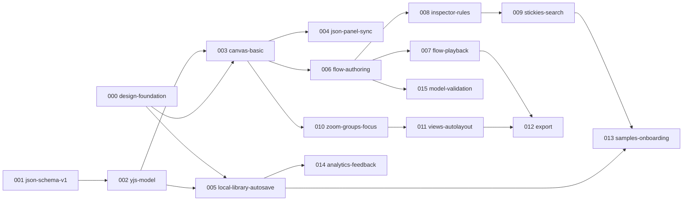

# Sododeck implementation backlog (MVP, M1–M5)

Bounded Spec Kit features derived from the Claude Design prototype
([`docs/design/design-analysis.md`](design/design-analysis.md), screenshots in
[`docs/design/screens/`](design/screens/)) and the P0 requirements in [`docs/spec.md`](spec.md).
Each feature is 1–5 days and goes through `/speckit.specify → /speckit.plan → /speckit.tasks →
/speckit.implement`. **Do not start a feature before its dependencies are merged.**

Status: draft for founder review (2026-09-27). Items marked **⚠ decision** depend on the open
questions in design-analysis §g.

**Design update (2026-09-27):** Claude Design added states 41–85 (flow recording and branches,
edge drawing, multi-select, problems, cloud/partner kinds, stickies, semantic zoom, collapsible
groups, folder and deck menus, storage, multi-tab, autosave). Screens are in
`docs/design/screens/41-…` to `85-…` (light and dark); the analysis and every conflict with
DESIGN.md or the founder decisions are in design-analysis §a and §g-18–§g-32. Founder decisions
below still win over the new frames (notably: deletes ask for confirmation, SLA target only,
autosave ≤ 300 ms, owner is free text).

## Founder decisions (2026-09-27)

Recorded in design-analysis §g and applied to the features below.

| §g  | Decision                                                                                                                                                                                        | Affects                 |
| --- | ----------------------------------------------------------------------------------------------------------------------------------------------------------------------------------------------- | ----------------------- |
| 3   | JSON panel is **read-only** for now: it shows the canvas as JSON (selection tab + whole-deck tab), updates live, can be copied and collapsed. Editing from JSON (C-5 two-way sync) is deferred. | 004                     |
| 6   | Build the **rule test panel** + catch-all check in 008; SLA shows the **target only** (no "measured" value); the 3-step tour stays in M5 (013).                                                 | 007, 008, 013           |
| 7   | Autosave: every change is persisted immediately; the top bar shows "Saving…" (cosmetic, held ≤ 300 ms) then "Saved in this browser", plus an error state "Couldn't save — export a backup".     | 005                     |
| 10  | Owner is **free text with suggestions** from owners already used in the deck (no team list).                                                                                                    | 001, 008                |
| 11  | Deleting asks for **confirmation**; undo (⌘Z) still works after a confirmed delete.                                                                                                             | 003, 005, 006, 008, 009 |
| 12  | Library "Recent" = the **8 most recently opened** decks (opened-at kept in library metadata, not in the deck).                                                                                  | 005                     |

## Dependency graph

## Critical path

**001 → 002 → 003 → 006 → 008 → 009 → 013** ≈ 3 + 4 + 5 + 5 + 5 + 4 + 3 = **29 working days**.
000 (4 d) runs in parallel with 001–002. The M4 branch 003 → 010 → 011 → 012 (≈ 19 d after 003)
can run in parallel with M2/M3 if a second agent is available.

Total estimate: **62 working days** for one agent sequentially (≈ 12–13 weeks), vs 6–8 weeks in spec
§13. Getting to 8 weeks needs two parallel streams (flows/knowledge vs scale/export) or cutting
scope (see report).

## Feature list

| ID  | Name                   | Milestone | Depends on | Est. | Needs design?                                  |
| --- | ---------------------- | --------- | ---------- | ---- | ---------------------------------------------- |
| 000 | design-foundation      | M1        | —          | 4 d  | —                                              |
| 001 | json-schema-v1         | M1        | —          | 3 d  | ⚠ decision (§g-4)                              |
| 002 | yjs-model              | M1        | 001        | 4 d  | —                                              |
| 003 | canvas-basic           | M1        | 000, 002   | 5 d  | designed (52–59, 61); ⚠ §g-19, §g-28           |
| 004 | json-panel-sync        | M1        | 003        | 2 d  | decided (§g-3): read-only                      |
| 005 | local-library-autosave | M1        | 000, 002   | 5 d  | designed (72–85); ⚠ §g-19, §g-25, §g-29        |
| 006 | flow-authoring         | M2        | 003        | 5 d  | designed (41–48); ⚠ §g-18                      |
| 007 | flow-playback          | M2        | 006        | 4 d  | — (branch picker in 46)                        |
| 008 | inspector-rules        | M3        | 006        | 5 d  | designed (49–51, 58); ⚠ §g-24, §g-26           |
| 015 | model-validation       | M3        | 006        | 2 d  | designed (60); ⚠ §g-23                         |
| 009 | stickies-search        | M3        | 008        | 4 d  | designed (62, 63); ⚠ §g-21                     |
| 010 | zoom-groups-focus      | M4        | 003        | 5 d  | designed (64–71); ⚠ §g-22                      |
| 011 | views-autolayout       | M4        | 010        | 5 d  | custom view config, layout button (default ok) |
| 012 | export                 | M5        | 007, 011   | 4 d  | —                                              |
| 013 | samples-onboarding     | M5        | 005, 009   | 3 d  | —                                              |
| 014 | analytics-feedback     | M5        | 005        | 2 d  | feedback button (small)                        |

Changes vs the original proposal: added **015-model-validation** (C-7 had no home); moved undo/redo
and multi-select into 003 and bulk edit into 008 (C-6); ⌘K (C-3) lives in 009 with global search
(K-4) because they share one surface in the design; the whole-deck JSON export/import (G-3) is in
005 and the full export dialog (I-1) in 012.

## Shared definition of done (every feature)

- [ ] **Constitution check** in `plan.md` against all eight principles; deviations justified in
      Complexity Tracking and approved by the founder. In particular: document data only in Yjs via
      `@sododeck/model` (I); schema + round-trip test for any file-format change (II); stable ids
      and rename-safe references (III); no network with content, all assets bundled (IV); heavy work
      in workers (V); keyboard operable + non-color state cues (VII); no new runtime dependency
      without approval (VIII).
- [ ] **Tests:** Vitest unit tests for every pure function and store; Testing Library component
      tests by role/label for user-visible behavior; model changes add a round-trip case in
      `packages/model/test`. A bug fix starts with a failing test.
- [ ] **E2E:** the existing smoke suite (`apps/app/tests/e2e/smoke.spec.ts`, incl. "no third-party
      requests") passes. New Playwright specs are **deferred** by constitution VI (TODO(e2e)); add
      one only if the founder amends the constitution.
- [ ] **Visual check:** screenshots of the implemented screens at 1440×900, light and dark, placed
      next to the matching `docs/design/screens/*.png` in the PR description; differences are
      either fixed or listed (allowed differences: DESIGN.md token overrides, lucide icons instead of
      Material Symbols — see design-analysis §g-1/§g-2).
- [ ] **Performance:** for canvas-touching features (003, 006, 007, 009, 010, 011), `pnpm bench`
      before and after, numbers in the report, no regression below 60 fps at 500 nodes / 1,000
      edges; flow highlight < 100 ms.
- [ ] `pnpm lint && pnpm typecheck && pnpm test && pnpm build && pnpm e2e` all pass.
- [ ] Docs: package `CLAUDE.md` updated when boundaries/APIs change; ADR for significant decisions.
- [ ] Small Conventional Commits; final report: what changed, what was skipped, what is uncertain.

---

## 000-design-foundation

- **Milestone:** M1 · **Depends on:** — · **Estimate:** 4 d
- **Goal:** Every screen can be built from shared, token-driven building blocks that look exactly
  like the design in light and dark, so feature work never re-invents buttons, inputs or tiles.
- **Spec IDs:** NFR accessibility (WCAG 2.1 AA), design system (DESIGN.md). Enables all others.
- **Design references:** all screens; tokens in design-analysis §c; components in §b "Chrome and form
  components"; e.g. [02-editor-node-selected](design/screens/02-editor-node-selected-light.png)
  (inputs, select, tags, segmented), [14-editor-palette-tab](design/screens/14-editor-palette-tab-light.png)
  (search field, kind tiles), [01-library](design/screens/01-library-light.png) (banner),
  [06-export-json](design/screens/06-export-json-light.png) (dialog, switch),
  [30-command-palette](design/screens/30-command-palette-light.png),
  [05-empty-deck-tour-1](design/screens/05-empty-deck-tour-1-light.png) (coach mark).
- **In scope:** motion tokens (dim 250 ms, ring 200 ms, token loop 1.4 s, step 1.7 s, toast 2.6 s,
  reduced-motion); extra shadows (hover, tour) and radii (segment 7, row 8, banner 14); lucide icon
  mapping table for the ~70 Material glyphs and the 6 node kinds; components: Input, InlineEdit,
  Textarea, Select, SearchField (with kbd hint), SegmentedControl, Switch, TagChip/TagInput,
  KindTile, Banner, Dialog, Toast, CoachMark, Button `chip` and `toggle` variants; a `/design`
  gallery route (dev only) showing every component in both themes.
- **Out of scope:** app screens, canvas components (React Flow nodes/edges live in the app), command
  palette behavior (009), changing DESIGN.md colors.
- **Acceptance criteria:**
  - Given the gallery in light theme, When compared with the design screenshots, Then buttons,
    inputs, select, segmented control, switch, tags, kind tiles, banner, dialog and coach mark match
    size, radius, type and color (except the DESIGN.md token overrides).
  - Given the theme is switched to dark, When the gallery re-renders, Then every component uses the
    dark token values with no hard-coded colors (lint rule or grep check passes).
  - Given keyboard only, When tabbing through the gallery, Then every interactive component shows a
    visible focus indicator and is operable (Space/Enter/arrows as appropriate).
  - Given `prefers-reduced-motion: reduce`, When motion tokens are read, Then durations resolve to 0
    and looping animations are disabled.
  - Given a kind name (client, gateway, service, queue, database, external), When rendering a
    KindTile, Then it shows the mapped lucide icon with that kind's soft/ink colors at 22/28/30/40 px.
  - Given a TagInput, When the user types "PII" and presses Enter twice, Then one tag "pii" exists.
- **Risks:** Command (cmdk) and Toast (sonner) are new runtime deps → need approval, or build small
  own versions; lucide lacks some glyphs (e.g. brand clouds); visual drift between Geist Variable
  (ours) and static Geist (design).
- **`/speckit.specify` prompt:**
  > Create the shared visual building blocks for Sododeck so every screen looks like the approved
  > design in both light and dark themes. Users should see consistent buttons (primary, secondary,
  > ghost, icon, chip, toggle), text fields, inline-editable text, multi-line text, selects, search
  > fields with a keyboard hint, segmented controls, switches, removable tag chips with an add
  > field, colored "kind" tiles for the six component kinds, banners (warning, success, error),
  > modal dialogs, toasts and a step-by-step coach-mark tooltip. Motion must be short and calm and
  > must respect the user's reduced-motion setting. Every control must be usable by keyboard with a
  > visible focus indicator and meet WCAG 2.1 AA contrast. Why: feature screens are built by
  > different agents over many weeks and must stay visually identical to the design and to each
  > other; accessibility must be built in from the start. Include a hidden gallery page that shows
  > every building block in every state and theme for visual review.
- **`/speckit.plan` hint:**
  > packages/ui only (plus a dev-only `/design` gallery route in apps/app). Follow
  > packages/ui/CLAUDE.md: shadcn conventions, Radix primitives already allowed, tokens only, no
  > `dark:` overrides. Add motion/shadow/radius tokens to tokens.css + theme.css and to the
  > tailwind-merge config in utils.ts. Icons: lucide-react; write the Material→lucide mapping table
  > in packages/ui (docs + a typed `kindIcon` map). Ask before adding cmdk/sonner; prefer Radix
  > Dialog/Popover. DESIGN.md token values win over the prototype (on-primary dark text, clay,
  > success). Match docs/design/screens/02-editor-node-selected-light.png,
  > 14-editor-palette-tab-light.png, 06-export-json-light.png, 05-empty-deck-tour-1-light.png
  > pixel-close for the components they contain. Component tests by role/label for each component.

## 001-json-schema-v1

- **Milestone:** M1 · **Depends on:** — · **Estimate:** 3 d
- **Goal:** A complete, versioned `.sododeck.json` format that can hold everything the design shows,
  so decks round-trip, validate and can be read by other tools.
- **Spec IDs:** §6 data model, G-3, I-1 (JSON), C-5 (schema for autocomplete), ADR 0002.
- **Design references:** design-analysis §d (field mapping table); data in
  [`claude-design/sododeck-data.js`](design/claude-design/sododeck-data.js); JSON shown in
  [16-editor-json-deck-tab](design/screens/16-editor-json-deck-tab-light.png) and
  [06-export-json](design/screens/06-export-json-light.png).
- **In scope:** full schema for deck metadata (name, description, tags), Node (type enum, title,
  group, level, owner, tags, description, tech, host, icon, links, rules, position), Group (title,
  parent), Edge (from, to, protocol enum, label, direction, description, links), View (type, title,
  subtitle field, includes, position overrides), Feature, Flow (feature, title, description, steps,
  trigger, outcome), Step (own id, edge, condition, sla, rules[], payload, notes, sample
  inputs), Rule (title, description, hit policy, inputs, outputs, rows with ids), Sticky (text,
  anchor, position, color); per-object key order; examples incl. a minimal deck and a deck with a
  flow + rule; Ajv/Zod parity; fix `sododeck.dev` vs `.com` in spec §6.
- **Out of scope:** step branches (moved to 006, added there as an optional field — no version
  bump), YAML import, comments/ADRs/state machines (P1), migrations (none yet), the Delivery
  sample (013).
- **Acceptance criteria:**
  - Given each example file, When validated with Ajv and with the generated Zod schema, Then both
    accept it, and both reject the same set of invalid fixtures (parity test).
  - Given a deck whose node has no `tech`, `host`, `icon`, `links` or `position`, When validated,
    Then it is valid (all additions are optional).
  - Given a rule, When it has a row whose number of `when` cells differs from its inputs, Then
    validation fails with a readable message.
  - Given a flow step, When it has no `id`, Then validation fails (every object has a stable id).
  - Given the schema file changed, When `pnpm test` runs without `pnpm schema:generate`, Then the
    staleness test fails.
- **Decisions (2026-09-27):** node kinds closed list `client, gateway, service, queue, database,
external`; protocol families `http, grpc, event, sql, websocket, other` (specifics in the label);
  positions on nodes with per-view overrides; structured rule tables; `rules[]` arrays; branches
  deferred to 006. See `specs/001-json-schema-v1/spec.md`.
- **Risks:** Zod generator limits (no recursive refs) for nested groups.
- **`/speckit.specify` prompt:**
  > Define version 1 of the Sododeck deck file (.sododeck.json) so that a deck can hold everything
  > an architect models: deck name and description; components with a kind, title, owner, tags,
  > markdown description, technology, hosting, links, attached rules and position; groups;
  > connections with protocol, label and direction; views; features; flows made of ordered steps
  > over existing connections, each step with a condition, SLA, attached rules and sample rule
  > inputs; business rules as decision tables with a hit policy, input and output
  > columns and rows; and sticky notes that are free or attached to an object. Every object has a
  > stable id that never changes when it is renamed, and all references are by id. The format must
  > be strict, documented and validated, so the app, a future CLI and AI agents can trust it, and
  > must stay readable in git diffs. Why: the file is the public contract and the only way data
  > leaves the browser; if it cannot express the design, users lose work on export.
- **`/speckit.plan` hint:**
  > packages/schema only. Edit schema/v1.json (draft 2020-12, local non-recursive $refs), run
  > `pnpm schema:generate`, extend examples/ and test/ (Ajv/Zod parity, invalid fixtures). Use
  > design-analysis §d as the field list; record the enum and table-shape decisions in an ADR
  > (0004; 0003 is the UI foundation ADR). Keep `rules` as an object keyed by id (ADR 0002). Every step and rule row gets an id.
  > No Yjs, no React. Update packages/schema/CLAUDE.md "Status".

## 002-yjs-model

- **Milestone:** M1 · **Depends on:** 001 · **Estimate:** 4 d
- **Goal:** One document model that every view edits safely, with undo, reference integrity and a
  lossless round-trip to the file.
- **Spec IDs:** §11 (Yjs source of truth), C-6 (undo/redo), C-7 (reference checks, groundwork), G-1.
- **Design references:** behavior in design-analysis §e (every edit in inspector, canvas, JSON and
  rule editor goes through the model); delete-node removes its edges
  ([02-editor-node-selected](design/screens/02-editor-node-selected-light.png)).
- **In scope:** Yjs layout for every v1 object; typed mutations (add/update/remove node, edge,
  group, flow, step, rule, row, column, sticky, view); cascade rules (deleting a node removes its
  edges and marks affected steps; deleting a rule detaches it); id generation; UndoManager scopes
  and grouping (one drag = one undo step); `toJSON`/`fromJSON` with per-object key order;
  referential validation report (edge → node, step → edge, rule refs, anchors).
- **Out of scope:** storage providers (005), UI, schema migrations.
- **Acceptance criteria:**
  - Given any valid example file, When `toJSON(fromJSON(x))` runs, Then the result deep-equals `x`
    (one round-trip case per object type).
  - Given a node referenced by two edges and a flow step, When the node is renamed, Then all
    references still resolve; When it is deleted, Then both edges are removed and the step is
    reported as broken.
  - Given ten title keystrokes followed by undo, When undo runs once, Then the title returns to its
    value before the edit burst (grouped by the capture timeout).
  - Given a new node is added, When its id is inspected, Then it is unique, not derived from the
    title, and unchanged after rename.
  - Given the model package, When run in Node without DOM, Then all tests pass (worker-safe).
- **Risks:** Yjs layout is persisted in IndexedDB from 005 on — later changes need an ADR and a
  migration; ordering of steps/rows in Y.Array under concurrent edits.
- **`/speckit.specify` prompt:**
  > Provide a single deck model that all editing surfaces (canvas, inspector, JSON panel, rule
  > editor) change, so they can never disagree. Users can add, edit, move and delete components,
  > groups, connections, flows, steps, rules and sticky notes; deleting a component also removes its
  > connections and flags any flow step that used them; renaming never breaks a reference. Users can
  > undo and redo their edits, where a burst of typing or one drag counts as a single step. Saving
  > and loading a deck file must never lose or change data. Why: two-way sync between picture and
  > text, undo, multi-tab safety and later collaboration only work with one trustworthy model.
- **`/speckit.plan` hint:**
  > packages/model only (depends on @sododeck/schema). Document the Yjs layout at the top of
  > src/deck.ts; typed accessors/mutations; Y.UndoManager with captureTimeout; referential
  > validation returns a typed problem list (used by 015). Round-trip tests in packages/model/test
  > per object type. No React/DOM/storage. Update packages/model/CLAUDE.md.

## 003-canvas-basic

- **Milestone:** M1 · **Depends on:** 000, 002 · **Estimate:** 5 d
- **Goal:** Architects can draw a system on a blank canvas: add, connect, move, select and delete
  components, and navigate large diagrams.
- **Spec IDs:** C-1, C-2, C-6 (undo/redo, multi-select), NFR performance, a11y.
- **Design references:** [02-editor-node-selected](design/screens/02-editor-node-selected-light.png) ·
  [dark](design/screens/02-editor-node-selected-dark.png),
  [10-editor-deck-inspector](design/screens/10-editor-deck-inspector-light.png),
  [11-editor-edge-selected](design/screens/11-editor-edge-selected-light.png),
  [12-editor-labels-on](design/screens/12-editor-labels-on-light.png),
  [14-editor-palette-tab](design/screens/14-editor-palette-tab-light.png),
  [37-empty-deck-no-tour](design/screens/37-empty-deck-no-tour-light.png),
  [38-empty-deck-node-added](design/screens/38-empty-deck-node-added-light.png); edge drawing
  [52](design/screens/52-edge-hover-light.png) hover handles, [53](design/screens/53-edge-dragging-light.png) dragging, [54](design/screens/54-edge-valid-target-light.png) valid
  target, [55](design/screens/55-edge-invalid-drop-light.png) invalid drop, [56](design/screens/56-edge-keyboard-light.png) keyboard connect,
  [57](design/screens/57-edge-popover-light.png) inline edge popover; [58](design/screens/58-multi-select-light.png) multi-select,
  [59](design/screens/59-bulk-delete-light.png) bulk delete; [61](design/screens/61-cloud-partner-light.png) cloud/partner kinds (⚠ §g-28). Each has a
  `-dark` twin. Components: node,
  group boundary, edge + label pill, minimap, zoom control, canvas breadcrumb, Labels toggle,
  outline, palette, empty-canvas card, top bar. Tokens: canvas, dot, edge, kind tints,
  shadow-rest/selection, dim 250 ms.
- **In scope:** editor shell layout (top bar, left panel with Outline/Palette, canvas, inspector
  column, JSON panel slot); React Flow nodes (164×50, kind tile, subtitle, rule glyph), group
  boundaries (bounds from members), edges (smoothstep, 8px radius, end dot, 12px hit area) with
  label pills; select node/edge, click empty to deselect; drag to move; palette drag/click to add;
  delete (Del key + inspector trash) with a confirmation dialog (§g-11; the design's delete-at-once +
  6 s Undo toast in 57/59 is overridden, §g-19), then undo via ⌘Z; draw an edge (designed, 52–57):
  four side handles on hover or Tab focus, dashed ghost line while dragging, valid target = dashed
  orange ring + "+", invalid (already connected or self) = dashed clay ring + ban icon + tooltip,
  release on empty canvas cancels, keyboard connect with C (type-ahead "Connect X to…" listbox,
  duplicates disabled), inline popover for label / protocol / direction after creating or on
  double-click; reconnect an endpoint (still default design); undo/redo (⌘Z/⇧⌘Z); shift-click / marquee / ⌘A multi-select with a
  selection frame and "n selected" pill (58);
  zoom −/+/fit 30–200%, fit on open; minimap with click-to-pan; Labels toggle; outline tree with
  collapse and select; empty-canvas card; minimal inspector: title for node/edge, name for deck;
  keyboard: Tab into canvas, arrow keys move selection between nodes.
- **⚠ decision (§g-28):** cloud and partner kinds (61: neutral cloud tile + AWS / GCP / AZURE
  text badge, partner handshake tile, cloud fields provider / service / region / resource id) need
  an additive schema change. Proposal: in scope here if the founder agrees (adds about half a day:
  enum values, optional fields, fixtures, parity and round-trip tests); otherwise a follow-up.
- **Out of scope:** full inspector fields (008), JSON panel (004), flows (006/007), focus mode,
  drill-down and views (010/011), stickies (009), ⌘K (009), auto-layout (011), queue-lane routing.
- **Acceptance criteria:**
  - Given an empty deck, When the user drags "Service" from the palette onto the canvas, Then a
    "New service" node appears at the drop point, is selected, and the outline lists it.
  - Given two nodes, When the user drags from one node's handle to the other, Then a new edge
    exists in the model, is selected, and the inline popover opens with focus on its label.
  - Given two nodes that are already connected, When the user drags from one onto the other, Then
    the target shows the invalid state (ban icon + text, not colour only) and releasing creates
    nothing; releasing on empty canvas also creates nothing.
  - Given a focused node, When the user presses C, types part of another node's title and presses
    Enter, Then an edge to that node is created; nodes that would duplicate an edge are listed as
    disabled "already connected".
  - Given a selected node, When the user presses Delete, Then a confirmation dialog names what will
    be removed (the node and its n edges); When confirmed, Then they disappear; When ⌘Z is pressed,
    Then both come back with the same ids. When cancelled (or Esc), Then nothing changes.
  - Given a node is dragged, When the pointer is released and ⌘Z pressed once, Then the node returns
    to its previous position.
  - Given Labels is off, When the user turns it on, Then every edge shows its Mono label pill.
  - Given keyboard focus on the canvas, When the user presses arrow keys, Then selection moves to the
    nearest node in that direction and the focus ring is visible.
  - Given the 500-node / 1,000-edge bench deck, When `pnpm bench` runs, Then pan/zoom stays ≥ 60 fps.
- **Risks:** React Flow performance with custom nodes at 500+ nodes; keyboard connect (C) and the
  edge popover add focus-management work; keeping React Flow state derived (never authoritative)
  under drag.
- **`/speckit.specify` prompt:**
  > Let an architect draw a system from a blank canvas. They pick component kinds (client, gateway,
  > service, queue, database, external) from a palette by dragging or clicking, connect components
  > by dragging from one to another, move them, select one or several, delete them, and undo or redo
  > any of that. Components show a colored kind tile, a title and a short subtitle; groups show a
  > dashed boundary with a label; connections show their label on demand. Users can zoom, fit the
  > diagram, pan with a minimap and browse all components in an outline tree. An empty deck explains
  > how to start. Everything must work with the keyboard and stay smooth with 500 components and
  > 1,000 connections. Why: designing a solution before code exists is the first job of the primary
  > user, and diagrams in this domain get large.
- **`/speckit.plan` hint:**
  > apps/app/src/editor (canvas.tsx, deck-node.tsx, deck-to-flow.ts, left-sidebar.tsx, top-bar.tsx
  > exist as M0 placeholders), reuse packages/ui (000). React Flow state is derived from
  > useDeckSnapshot and never authoritative; writes via @sododeck/model mutations; selection/zoom/
  > labels in the Zustand UI store. Edges: smoothstep, 8px radius (no custom queue lane). Run
  > `pnpm bench` before/after. Match docs/design/screens/02-editor-node-selected-light.png,
  > 14-editor-palette-tab-light.png, 37-empty-deck-no-tour-light.png, 12-editor-labels-on-light.png
  > and 52-edge-hover … 58-multi-select (light and dark) pixel-close (lucide icons instead of
  > Material Symbols; DESIGN.md clay; confirmation dialog before delete per §g-11).

## 004-json-panel-sync

- **Milestone:** M1 · **Depends on:** 003 · **Estimate:** 2 d
- **Decision (§g-3, 2026-09-27):** the panel is **read-only** for now. It shows the canvas as
  JSON; editing from JSON (C-5 two-way sync) is deferred. `TODO(C-5)`: editable Deck/Selection
  tabs, schema autocomplete, inline parse errors, paste-a-deck.
- **Goal:** Developers see the deck as JSON next to the canvas, always in sync with what they draw,
  so "the diagram is data" is visible from day one.
- **Spec IDs:** C-5 (read-only part).
- **Design references:** [02-editor-node-selected](design/screens/02-editor-node-selected-light.png)
  (selection tab), [16-editor-json-deck-tab](design/screens/16-editor-json-deck-tab-light.png),
  [17-editor-json-collapsed](design/screens/17-editor-json-collapsed-light.png). Tokens: code
  surface, text-code. Not used now: 15-editor-json-error, 39-empty-deck-paste-json (editing).
- **In scope:** panel header (JSON label, Selection/Deck segmented tabs, status "Read-only · synced
  with canvas", line count, Copy, collapse); Selection tab for node/edge (step in 007), empty
  selection message; Deck tab = the whole `.sododeck.json` produced by `@sododeck/model`; live
  update when the canvas changes (throttled for large decks); syntax highlighting, folding, keyboard
  scroll and select; resizable/collapsible panel.
- **Out of scope:** editing JSON, schema autocomplete, parse/schema errors, paste a deck (all
  deferred with C-5); YAML view (P1); diff view.
- **Acceptance criteria:**
  - Given a selected node, When the user renames it on the canvas or in the inspector, Then the
    Selection tab shows the new `"title"` without reload.
  - Given the Deck tab, When the user adds or deletes a node on the canvas, Then the JSON updates
    and equals the model's export of the deck (same text as the exported file).
  - Given the panel, When the user tries to type in it, Then nothing changes and the status says
    "Read-only" (with an icon, not color only).
  - Given the Copy button, When pressed, Then the shown JSON is on the clipboard and a toast
    confirms it.
  - Given the panel is collapsed, When the page reloads, Then it stays collapsed (UI preference).
  - Given the JSON panel, When no network is available, Then it still renders (bundled Monaco, no
    requests).
- **Risks:** large decks make full-deck JSON slow (throttle; serialize in a worker if over 16 ms);
  keeping Monaco for a read-only view is heavier than a highlighted `<pre>`, but it makes the later
  switch to editing cheap and keeps folding/virtual scrolling for big files.
- **`/speckit.specify` prompt:**
  > Show the deck as JSON in a panel under the canvas, always in sync with the diagram. Users can
  > view the JSON of the current selection or of the whole deck, fold and scroll it, copy it, and
  > collapse or resize the panel. The panel is read-only in this version: it explains that edits
  > happen on the canvas and in the inspector. Why: developers think in text and the product
  > promise is "the diagram is data"; seeing the exact file content next to the picture builds
  > trust before two-way editing arrives.
- **`/speckit.plan` hint:**
  > apps/app/src/editor/json-panel.tsx + json-editor.tsx + monaco-setup.ts (bundled, deep imports,
  > no CDN), Monaco with `readOnly: true`. Monaco models are views: derive text from the Yjs
  > snapshot via @sododeck/model's JSON export; never keep document data in Monaco. Throttle
  > updates; move serialization to a worker if it exceeds 16 ms. Match
  > docs/design/screens/16-editor-json-deck-tab-light.png and 17-editor-json-collapsed-light.png
  > pixel-close (status text differs: "Read-only · synced with canvas").

## 005-local-library-autosave

- **Milestone:** M1 · **Depends on:** 000, 002 · **Estimate:** 5 d
- **Goal:** Guests keep many decks in the browser with no account, never lose work, and are nudged to
  back up.
- **Spec IDs:** G-1, G-2, G-3, G-4, G-5, G-6.
- **Design references:** [01-library](design/screens/01-library-light.png) ·
  [dark](design/screens/01-library-dark.png), [07-library-list-view](design/screens/07-library-list-view-light.png),
  [08-library-search-no-results](design/screens/08-library-search-no-results-light.png),
  [09-library-folder-banner-dismissed](design/screens/09-library-folder-banner-dismissed-light.png);
  editor top bar autosave status in [02](design/screens/02-editor-node-selected-light.png); deck
  inspector STORAGE section in [10](design/screens/10-editor-deck-inspector-light.png);
  [72](design/screens/72-new-folder-empty-light.png) / [73](design/screens/73-new-folder-duplicate-light.png) new-folder dialog errors,
  [74](design/screens/74-folder-menu-light.png) folder menu, [75](design/screens/75-folder-rename-light.png) folder delete + inline rename,
  [76](design/screens/76-deck-menu-card-light.png) / [77](design/screens/77-deck-menu-row-light.png) deck menus, [78](design/screens/78-recent-light.png) Recent,
  [79](design/screens/79-recent-empty-light.png) Recent empty, [80](design/screens/80-storage-off-light.png) storage off + Safari banner,
  [81](design/screens/81-storage-on-light.png) storage on, [82](design/screens/82-second-tab-light.png) deck open in another tab,
  [83](design/screens/83-autosave-saving-light.png) / [84](design/screens/84-autosave-saved-light.png) / [85](design/screens/85-autosave-error-light.png) autosave states (each with a
  `-dark` twin). Components: deck card, new-deck card, list row, backup banner, storage card,
  search field, segmented grid/list, small dialog, context menu + submenu, recent list, read-only
  banner, autosave status + error popover.
- **In scope:** IndexedDB persistence per deck (Yjs provider) + library metadata (name, folder,
  counts, updatedAt, openedAt, lastBackupAt); library grid/list, All/Recent (8 most recently opened, §g-12)/Samples/folders, search; new deck;
  open deck; rename via breadcrumb; folders (designed 72–75: New folder dialog with inline errors for empty and case-insensitive
  duplicate names, context menu Rename / Export folder / Delete folder, F2 inline rename; delete
  asks for confirmation per §g-11 — the design's delete-at-once + Undo is overridden, §g-19; decks
  of a deleted folder move to Unfiled); deck menu on cards and rows (76–77: Open, Rename F2,
  Duplicate ⌘D, Move to folder submenu with the current folder checked, Export .sododeck.json,
  Delete) via ⋯, right-click or Shift+F10; delete deck (confirm); import .sododeck.json (validate, error toast); export one deck
  and "Export backup" of all decks; storage card (80–81: usage bar, Persistent storage On/Off
  status with icon + text, "Request persistent storage", "Browser declined…" text) and
  `storage.persist()` request; backup reminder after N days + Safari 7-day banner (80); multi-tab
  (82): BroadcastChannel so two tabs never overwrite — the second tab is read-only with an amber
  banner and "Use here instead" to take over; fields greyed with a lock, handles and palette
  disabled, select and export still work; autosave status in the top bar (§g-7: "Saving…"
  held ≤ 300 ms → "Saved in this browser"; error state "Couldn't save — export a backup" as a clay
  pill with Export and a popover with Export .sododeck.json and Retry ⌘S (85); the design's
  "~650 ms" in 83 is overridden, §g-25); thumbnails
  (simplified, generated from positions).
- **⚠ decision (§g-29):** Duplicate deck and "Use here instead" are proposed in scope (small);
  Export folder is deferred to 012.
- **Out of scope:** sample decks content (013), full export dialog (012), Export folder (012), File
  System Access (P1), cloud sync.
- **Acceptance criteria:**
  - Given the user edits a deck, When 500 ms pass and the tab is closed, Then reopening shows the
    edit.
  - Given three decks in two folders, When the user selects a folder or types in search, Then only
    matching decks show, and "No decks match "x"." appears when none match.
  - Given a valid .sododeck.json file, When imported, Then it appears in the library with its node
    and flow counts; Given an invalid file, Then a toast says it is not valid and nothing is added.
  - Given the last backup is older than the reminder threshold, When the library opens, Then the
    amber banner shows with "Export backup"; When dismissed, Then it stays hidden for this session.
  - Given the same deck open in two tabs, When the second tab opens it, Then that tab shows the
    read-only banner, "Read-only" status and disabled editing; When the user picks "Use here
    instead", Then this tab becomes editable and the other tab shows the banner.
  - Given the New folder dialog, When Create is pressed with an empty name or a name that matches an
    existing folder ignoring case and surrounding spaces, Then an inline error with an icon shows
    under the field and no folder is created.
  - Given `storage.persist` is unavailable, When the app starts, Then it falls back silently and
    the meter shows "not persistent" (feature-detected via lib/features.ts).
  - Given nine decks opened at different times, When the user selects Recent, Then the 8 most
    recently opened show, newest first.
  - Given a save fails (e.g. quota exceeded), When the user edits, Then the top bar shows "Couldn't
    save — export a backup" with an icon (not color only) and an Export button; the state clears
    only after a later save succeeds.
  - Given no deck was ever opened, When the library shows, Then Recent shows the dashed empty
    placeholder.
- **Risks:** Safari eviction; lock hand-over between tabs ("Use here instead") must be race-free;
  thumbnail generation cost for large decks (worker).
- **`/speckit.specify` prompt:**
  > Let guests keep a library of decks in their browser without an account. Every change is saved
  > automatically within half a second and the editor shows "Saving…" then "Saved in this browser".
  > The library shows decks as cards or a list, with folders, recent decks, samples and search; users
  > can create, open, rename, move and delete decks and manage folders. Users can import a deck
  > file, export one deck, and export a backup of all decks. The app shows how much browser storage
  > is used, asks the browser to keep the data persistently, and reminds users to back up because
  > data lives only on this device. Opening the same deck in two tabs must never lose edits. Why:
  > local-first with no lock-in is a core promise, and guest data loss is a top product risk.
- **`/speckit.plan` hint:**
  > apps/app/src/storage (Dexie for library metadata), y-indexeddb provider attached to the Yjs doc,
  > src/routes/library-page.tsx, top-bar autosave status; BroadcastChannel and storage.persist via
  > src/lib/features.ts with fallbacks. Serialization only through @sododeck/model. Library route
  > stays light (no React Flow/Monaco imports). Thumbnails from positions, rendered as simple SVG.
  > Match docs/design/screens/01-library-light.png, 01-library-dark.png, 07-library-list-view-light.png,
  > 08-library-search-no-results-light.png and 72-… to 85-… (light and dark) pixel-close, except
  > the overrides in design-analysis §g-19 (confirm before delete) and §g-25 (≤ 300 ms).

## 006-flow-authoring

- **Milestone:** M2 · **Depends on:** 003 · **Estimate:** 5 d
- **Goal:** Architects capture each business flow as an ordered path over existing connections,
  with conditions and branches, grouped by feature.
- **Spec IDs:** F-1, F-4, F-5, K-1 (flow/step title + description).
- **Design references:** left panel FEATURES list in
  [02-editor-node-selected](design/screens/02-editor-node-selected-light.png) and flow list/steps in
  [03-flow-mode](design/screens/03-flow-mode-light.png); recording [41](design/screens/41-rec-empty-light.png) empty,
  [42](design/screens/42-rec-mid-light.png) mid recording, [43](design/screens/43-rec-invalid-light.png) invalid click, [44](design/screens/44-rec-finished-light.png) finished;
  branches [45](design/screens/45-branch-create-light.png) creating, [46](design/screens/46-branch-tree-light.png) tree + error path; flow filter
  [47](design/screens/47-flow-filter-light.png), [48](design/screens/48-flow-filter-empty-light.png) no results (each with a `-dark` twin).
  Components: recording chip, editable step row, recording hint / error card, branch header, edge
  step badge, candidate / invalid / error-path edge styles, invalid-edge popover, flow filter.
- **In scope:** features (create/rename/delete; deletes ask for confirmation, §g-11) and flows per feature in the left panel with a
  filter field (47–48: / to focus, "n of m" count, matches bold + underlined, searches names, step
  labels and conditions; empty state with "Clear filter" and "New flow '…'"); recording mode
  (designed 41–44): "+ New flow" names the flow, top-bar chip "Recording 'name' · n steps" with
  Undo ⌘Z / Done / Cancel Esc replaces the view switcher, canvas stays at full opacity, hovering an
  edge previews it, recorded edges get numbered badges, the next start node gets a ring and its
  outgoing edges show as dotted candidates, a click on an edge that does not start where the last
  step ended is **not added** and a popover offers "Add as branch from step n" (§g-18), Tab /
  Shift+Tab + Enter pick edges by keyboard, Done disabled until one step exists, Esc asks only if
  steps exist; edit step
  condition, SLA, description; reorder (grip drag, ⌥↑/⌥↓) / delete (⌫) steps, where a reorder that breaks the chain marks
  rows with a dashed clay dot + alert icon and blocks Done; branches (45–46): B on a focused step
  adds a branch with a required label and condition and an Error path toggle, the step list indents
  branches under "◇ condition" headers with 4a/4b numbering, error paths are dashed clay + icon on
  the edge label and step badge; broken steps (edge deleted) flagged.
  Adds the step `branch` field to the file format (deferred from 001): an additive optional field
  in `packages/schema` (fixtures + Ajv/Zod parity) and `packages/model` (round-trip case), no
  version bump; shape recorded in an ADR.
- **Out of scope:** playback, token animation and step inspector visuals (007), rules on steps (008),
  flow comparison (P1), sequence/swimlane (P1).
- **Acceptance criteria:**
  - Given a deck with edges, When the user starts recording "Place order" and clicks three edges in
    order, Then the flow has three steps referencing those edges in that order.
  - Given recording, When the user clicks an edge whose source is not the previous step's target,
    Then no step is added, the edge shows the invalid state (dashed + ban icon), a popover and a
    polite live region explain why, and "Add as branch from step n" is offered when that edge
    leaves an earlier step's node. (Changed from "added but marked" to follow design 43, §g-18.)
  - Given recording with no steps, When the user looks at Done, Then it is disabled; Given steps,
    When the user presses Esc, Then a confirmation asks before discarding them.
  - Given a new branch, When the user presses Done with an empty label or condition, Then an inline
    error shows on the empty field and the branch is not saved.
  - Given a flow, When the user adds a branch at step 2 labelled "payment declined" and marks it as
    an error path, Then the branch steps render dashed with an error icon on the canvas.
  - Given ten flows in a feature, When the user types "fail" in the flow filter, Then only matching
    flows show.
  - Given an edge used by a step is deleted, When the flow is shown, Then that step shows a "broken"
    indicator with text, and undo restores it.
  - Given only the keyboard, When recording, Then edges can be chosen via Tab/arrow navigation and
    Enter.
- **Risks:** branch model complexity (keep to one level of branching in MVP, as in 46); edges reused
  by several steps; keyboard edge picking during recording.
- **`/speckit.specify` prompt:**
  > Let architects record business flows on top of the existing diagram. A feature (for example
  > "Delivery") groups many flows. To create a flow, the user starts recording and clicks existing
  > connections in order; each click adds a step, without redrawing anything. Each step can have a
  > title, description, condition and SLA target. A flow can branch at a step into an alternative
  > path with its own condition, and error paths look clearly different from the happy path (not by
  > color alone). Users can reorder, remove and edit steps, rename and delete flows and features,
  > and filter the flow list. If a connection used by a step is deleted, the step is shown as broken
  > instead of silently disappearing. Why: a feature with 10–20 flows is unreadable as one blob;
  > flows must be first-class objects, and creating them must be fast.
- **`/speckit.plan` hint:**
  > apps/app/src/editor (left panel flow list, recording mode in the Zustand UI store as UI state
  > only; steps written via @sododeck/model mutations from 002). Step shape per the 001 schema;
  > add the optional step `branch` field to packages/schema/schema/v1.json (run
  > `pnpm schema:generate`, fixtures, parity) and a round-trip case in packages/model, with an ADR
  > for the branch shape. The ADR records the branch
  > shape the design settles: fork step, label, condition, `errorPath` flag. Run `pnpm bench`
  > (flow highlight < 100 ms). Match docs/design/screens/41-rec-empty … 48-flow-filter-empty
  > (light and dark) and the left-panel list of 03-flow-mode-light.png pixel-close (DESIGN.md clay
  > for error paths).

## 007-flow-playback

- **Milestone:** M2 · **Depends on:** 006 · **Estimate:** 4 d
- **Goal:** Anyone can select a flow and watch it light up end to end, step by step, while
  explaining it to a colleague.
- **Spec IDs:** F-2, F-3.
- **Design references:** [03-flow-mode](design/screens/03-flow-mode-light.png) ·
  [dark](design/screens/03-flow-mode-dark.png),
  [24-flow-step-no-rule](design/screens/24-flow-step-no-rule-light.png),
  [25-flow-step-sla-over](design/screens/25-flow-step-sla-over-light.png),
  [26-flow-playing-2x](design/screens/26-flow-playing-2x-light.png),
  [27-flow-mode-labels-dark](design/screens/27-flow-mode-labels-dark.png); [44](design/screens/44-rec-finished-light.png) flow
  mode right after recording, [46](design/screens/46-branch-tree-light.png) player with the branch picker at a fork,
  [50](design/screens/50-insp-flow-light.png) flow with numbered step badges. Components: flow chip,
  step player, step rows, flow token, highlighted edges/labels, step inspector (condition, rules
  placeholder, SLA target), step JSON. Motion: token loop 1.4 s ÷ speed, step 1.7 s ÷ speed, dim
  250 ms.
- **In scope:** enter flow mode (left list, edge "Used in flows", later ⌘K); dim non-flow nodes/edges
  (plus a non-color cue: flow edges show step numbers on their labels); current step thick edge,
  solid label, looping token; step player (prev / play-pause / next, 1×/2×, progress segments);
  ← / → keys; click step row / segment / flow edge / flow node to jump; step inspector (from → to,
  protocol, condition, description, SLA target, rules section showing attached rule names —
  table view comes with 008); step JSON read-only in the JSON panel; exit via chip × / Back / Esc;
  reduced-motion: static token; `aria-live` announcement of the current step; flows with branches
  (46): step badges 4a/4b, a branch picker ("AT STEP n" segmented control) in the player at a
  fork, ↑/↓ switch branch.
- **Out of scope:** "measured" SLA and meter fill from fake data (decided §g-6: show target only),
  compact decision table (008), export of a flow (012).
- **Acceptance criteria:**
  - Given a flow with 8 steps, When the user opens it, Then flow edges are highlighted, other
    elements dimmed, step 1 is current, and highlight appears in < 100 ms on the bench deck.
  - Given step 4 is current, When the user presses →, Then step 5 becomes current, its edge gets the
    token, and a screen reader announces "Step 5 of 8: Order Service → Payment Service".
  - Given play at 1×, When 1.7 s elapse, Then the player advances one step; at 2× every 0.85 s; on
    the last step playback stops.
  - Given play is pressed on the last step, When playback starts, Then it restarts from step 1.
  - Given `prefers-reduced-motion`, When a step is current, Then no token moves and the current
    edge is still distinguishable by width and label.
  - Given flow mode, When the user clicks a node that belongs to the flow, Then the first step
    touching that node becomes current.
- **Risks:** SVG animateMotion along React Flow edge paths when edges re-route; many dimmed
  elements repainting on each step (perf).
- **`/speckit.specify` prompt:**
  > Let users play a flow like a presentation. Selecting a flow highlights its path, dims
  > everything else, and a token travels along the current step's connection. A player lets users
  > go to the previous or next step, play and pause at normal or double speed, and jump to any step
  > from the progress bar, the step list, or by clicking the diagram; arrow keys also step through
  > the flow. A side panel shows the current step's from and to components, protocol, condition,
  > description, SLA target and attached rules. The current step is clear without relying on color,
  > is announced to screen readers, and animation stops for users who prefer reduced motion. Why:
  > tracing one flow end to end is the core value and the north-star metric ("flows played").
- **`/speckit.plan` hint:**
  > apps/app/src/editor: flow mode + current step in the Zustand UI store (UI state); derived
  > highlight sets memoized; token as an SVG overlay along the React Flow edge path; timers cleaned
  > up on exit. Inspector step view in inspector.tsx. Motion values from 000 tokens. Run `pnpm
bench` before/after (flow highlight < 100 ms). Match docs/design/screens/03-flow-mode-light.png,
  > 03-flow-mode-dark.png, 24-flow-step-no-rule-light.png, 26-flow-playing-2x-light.png pixel-close
  > (SLA section shows target only).

## 008-inspector-rules

- **Milestone:** M3 · **Depends on:** 006 · **Estimate:** 5 d
- **Goal:** Knowledge lives next to what it describes: every object has rich details, and business
  rules are decision tables reused across flow steps.
- **Spec IDs:** K-1, K-2, C-6 (bulk edit).
- **Design references:** node inspector in [02](design/screens/02-editor-node-selected-light.png),
  [18-editor-markdown-preview](design/screens/18-editor-markdown-preview-light.png),
  [23-editor-inspector-scrolled](design/screens/23-editor-inspector-scrolled-light.png); edge
  inspector [11](design/screens/11-editor-edge-selected-light.png); deck inspector
  [10](design/screens/10-editor-deck-inspector-light.png); rule editor
  [04](design/screens/04-rule-editor-light.png) · [dark](design/screens/04-rule-editor-dark.png),
  [28-rule-editor-no-match](design/screens/28-rule-editor-no-match-light.png),
  [29-rule-editor-other-rule](design/screens/29-rule-editor-other-rule-light.png); compact table on a
  step in [03](design/screens/03-flow-mode-light.png); [49](design/screens/49-insp-edge-light.png) edge inspector,
  [50](design/screens/50-insp-flow-light.png) flow inspector, [51](design/screens/51-insp-step-light.png) step inspector (SLA shows target only,
  §g-24), [58](design/screens/58-multi-select-light.png) bulk inspector with "Mixed" (each with a `-dark` twin). Components: micro-label sections, markdown
  Write/Preview, tag input, link rows, rule card, decision table (full + compact), test result
  banner.
- **In scope:** inspectors for node, edge, flow, step and deck with title, markdown description
  (write/preview), owner (free text + suggestions), tags, links; node tech/host; edge (49):
  title (= label), from / to, protocol segmented control, description, owner, direction, tags,
  links, "Used in flows"; flow (50): title, description, owner, feature, tags, links, summary;
  step (51): title, description, owner, edge, tags, condition, SLA target (no measured value or
  meter, §g-24), attached rules; connections list; multi-select bulk edit (58: kind, owner, tech,
  group, tags; differing values show "Mixed", tags on some nodes show dashed with "n/3", typing sets
  the value on all); rule editor route: list, create, rename, describe, hit
  policy, add/rename/remove condition and action columns, edit cells (syntax `≤ 5`, `> 20`, lists,
  `Any`), add/delete/reorder rows, delete rule; attach/detach rules on steps and nodes; "Used in"
  list; compact table on the step inspector with the matched row; rule test input panel +
  catch-all check (decided §g-6); deleting a rule asks for confirmation (§g-11).
- **Out of scope:** comments (P1), ADRs (P1), glossary (P1), full rule simulator across flows (A-1).
- **Acceptance criteria:**
  - Given a selected node, When the user edits title, description, owner, tags and links, Then the
    canvas, outline and JSON reflect each change and one ⌘Z undoes the last field edit.
  - Given a description with bullets and `code`, When Preview is chosen, Then bullets and inline
    code render; an empty description shows "Nothing to preview."
  - Given rule "Delivery tier" attached to two steps, When a cell is edited in the rule editor,
    Then both steps show the updated table (single shared rule).
  - Given test inputs Distance 5, Weight 10, Priority Express, When evaluated with First match, Then
    row 1 is highlighted and its actions listed; with Weight empty, Then "No row matches these
    inputs" shows in clay with an error icon.
  - Given three selected nodes, When the user sets owner "Dispatch" in the bulk inspector, Then all
    three change in one undo step.
  - Given three selected nodes with different owners, When the bulk inspector shows, Then Owner shows
    "Mixed" and a tag present on two of them shows as partial "2/3".
  - Given a rule used by steps, When the user deletes it, Then a confirmation dialog shows the usage
    count; When confirmed, Then the steps are detached (undo restores).
- **Risks:** scope is large (inspectors + rule editor) — split into 008a inspectors / 008b rules if
  it exceeds 5 days; cell-syntax parsing edge cases; markdown rendering must be safe (no raw HTML).
- **`/speckit.specify` prompt:**
  > Let users attach knowledge to everything on the diagram. Selecting a component, connection,
  > flow, step or the deck itself shows a side panel where they edit its title, a markdown
  > description with preview, owner, tags and links, plus type-specific fields (technology and
  > hosting for components; label, protocol and direction for connections; condition and SLA for
  > steps). Several components can be edited at once. Business rules are decision tables: named,
  > described, with a hit policy, condition and action columns and rows; conditions accept
  > comparisons, lists and "any". A rule is shared: attach it to any flow step or component and
  > edits apply everywhere; the rule shows where it is used, and a step shows its table with the
  > row that matches. Users can try inputs and see which row matches. Why: complex business rules
  > (thresholds, retries, SLAs) get lost in scattered docs; they must live on the exact step they
  > govern.
- **`/speckit.plan` hint:**
  > apps/app/src/editor/inspector.tsx (split per object type), new route /deck/:id/rules;
  > rule evaluation (cell matching, hit policy) as a pure, unit-tested module in packages/model
  > (no UI); markdown rendering without raw HTML (ask before adding a markdown dependency; the
  > design only needs paragraphs, bullets, inline code). Owner suggestions derived from the deck.
  > Match docs/design/screens/02-editor-node-selected-light.png, 49-insp-edge, 50-insp-flow,
  > 51-insp-step, 58-multi-select, 04-rule-editor-light.png, 28-rule-editor-no-match-light.png
  > pixel-close (success green per DESIGN.md for matches; owner is a free-text combobox styled
  > like the design's select, §g-26; SLA target only).

## 015-model-validation

- **Milestone:** M3 · **Depends on:** 006 · **Estimate:** 2 d
- **Goal:** Users see what is wrong in their model — orphan components, broken flows, duplicate
  connections — before it misleads a reader.
- **Spec IDs:** C-7.
- **Design references:** [60](design/screens/60-problems-light.png) · [dark](design/screens/60-problems-dark.png): PROBLEMS
  section in the deck inspector (orphan node, broken flow, duplicate edge, step without edge),
  amber triangle glyph on affected nodes and edges, amber "n problems" button on the canvas,
  "No problems" collapsed row. Broken-chain rows in the step list: [42](design/screens/42-rec-mid-light.png); bulk delete
  flags new problems: [59](design/screens/59-bulk-delete-light.png); overlapping branch conditions → amber warning (46).
- **In scope:** checks for orphan nodes, duplicate edges (same from/to/label), steps whose edge is
  missing, non-contiguous flows, rules referenced but missing, rules with no catch-all row; problem
  list with click / ↵ to select, ↑↓ to move, ⌘. to jump to the next problem from anywhere;
  "n problems" button on the canvas and triangle glyphs on affected objects; problems are derived
  and never written into the document or shown in the JSON panel (§g-23); computed off the main
  thread for large decks.
- **Out of scope:** custom lint rules (Q-4, P2), auto-fix.
- **Acceptance criteria:**
  - Given a node with no edges, When the Problems list is opened, Then it lists "Orphan: <title>"
    and clicking it selects and centers the node.
  - Given two identical edges, When validation runs, Then one "Duplicate connection" problem is
    listed.
  - Given a flow whose edge was deleted, When validation runs, Then "Broken flow: <flow> step n" is
    listed and the flow row shows a warning icon.
  - Given a 2,000-node deck, When validation runs, Then the UI stays responsive (runs in a worker).
- **Risks:** noise (orphans may be intentional) — allow dismissing per object later.
- **`/speckit.specify` prompt:**
  > Show users the problems in their model: components with no connections, duplicate connections,
  > flow steps whose connection was deleted, flows that jump between unconnected components, and
  > missing or incomplete rules. Problems appear in a list and as small warnings on the affected
  > objects; clicking a problem takes the user to it. Checking must not slow the editor on very
  > large decks. Why: a diagram that silently contains broken flows loses the trust that makes it
  > the source of truth.
- **`/speckit.plan` hint:**
  > Pure checks in packages/model (reuse referential validation from 002), run in a Web Worker for
  > large decks; UI in the deck inspector and outline/flow list glyphs. Match
  > docs/design/screens/60-problems-light.png and 60-problems-dark.png pixel-close.

## 009-stickies-search

- **Milestone:** M3 · **Depends on:** 008 · **Estimate:** 4 d
- **Goal:** Users leave reminders on the diagram and find anything — components, flows, rules,
  notes — from one keyboard shortcut.
- **Spec IDs:** K-3, K-4, C-3.
- **Design references:** ⌘K palette [30](design/screens/30-command-palette-light.png),
  [31 filtered](design/screens/31-command-palette-filtered-light.png),
  [32 no results](design/screens/32-command-palette-no-results-dark.png); top-bar "Jump to… ⌘K"
  field; palette STRUCTURE › Note in [14](design/screens/14-editor-palette-tab-light.png); sticky
  notes [62](design/screens/62-stickies-light.png) (free, pinned with a dotted leader, collapsed; sticky inspector) and
  [63](design/screens/63-stickies-flow-light.png) during a flow (each with a `-dark` twin).
- **In scope:** stickies (62–63): amber-soft 180 px markdown card, add from the palette (drop on a node pins it,
  on empty canvas it is free) or with N at the pointer, free or pinned to a node (dotted leader +
  pin, moves with it), expanded / collapsed (one line + chevron, ⌥C), "Stay visible during flows"
  (otherwise dimmed to 35% during playback unless its node is on the current step), deck-wide
  "Notes: dimmed / shown / hidden" switch in flow mode, empty note deleted on blur, delete (with
  confirmation, §g-11), show in outline; width is fixed at 180 px in the design, so resize is
  deferred; ⚠ §g-21: `collapsed` and show-in-flows as optional `Sticky` fields (additive schema
  change with fixtures, parity and round-trip tests); ⌘K palette: commands (export, theme, focus,
  rules, library, new deck), flows, nodes, edges, rules, stickies, with matches in titles,
  descriptions, notes and rule cells (snippet line); Enter opens the first result, arrows move,
  Esc closes; results show kind; "No results".
- **Out of scope:** comments/threads (P1), glossary (P1), search across decks in the library beyond
  names.
- **Acceptance criteria:**
  - Given a sticky anchored to "Order Service", When the node is moved, Then the sticky moves with
    it; When the node is deleted, Then the sticky becomes free (not lost).
  - Given flow mode is playing, When a step is current, Then notes are dimmed except those pinned to
    a node of the current step or marked "Stay visible during flows".
  - Given a new empty note, When it loses focus, Then it is removed.
  - Given ⌘K, When the user types "reattempt", Then the rule "Reattempt policy" and the flow step
    whose condition mentions it appear, and Enter opens the first.
  - Given the palette, When the user presses ↓ twice and Enter, Then the third result opens.
  - Given a query with no matches, When typed, Then "No results" shows and Enter does nothing.
  - Given a 2,000-node deck, When typing in ⌘K, Then results update in < 50 ms per keystroke.
- **Risks:** search index size (build incrementally from Yjs updates); dimmed notes at 35% must
  stay accessible (design-analysis §g-30).
- **`/speckit.specify` prompt:**
  > Let users put sticky notes on the diagram for reminders and open questions, either free on the
  > canvas or attached to a component so the note moves with it; notes support simple markdown and
  > can be edited, resized and deleted. Add a command palette opened with Cmd/Ctrl+K that finds any
  > component, connection, flow, rule or note by title or by text in descriptions, notes and rule
  > cells, and also runs common commands (export, switch theme, focus mode, open rules, go to the
  > library, new deck). It is fully keyboard driven and fast on large decks. Why: knowledge is only
  > useful if it can be found, and annotations need a home on the diagram.
- **`/speckit.plan` hint:**
  > Sticky as a React Flow node type in apps/app/src/editor; anchor handled in the model (position
  > relative to anchor). Command palette component from 000 (cmdk only if approved); search index
  > as a pure module (packages/model or app lib) updated from snapshots, off the main thread if
  > large. Match docs/design/screens/30-command-palette-light.png and
  > 31-command-palette-filtered-light.png, 62-stickies and 63-stickies-flow (light and dark)
  > pixel-close.

## 010-zoom-groups-focus

- **Milestone:** M4 · **Depends on:** 003 · **Estimate:** 5 d
- **Goal:** Large systems stay readable: users see one level at a time, collapse groups, and focus
  on one component's neighbourhood.
- **Spec IDs:** V-1, V-2, V-3.
- **Design references:** [13-editor-focus-mode](design/screens/13-editor-focus-mode-light.png),
  [19-editor-group-drilldown](design/screens/19-editor-group-drilldown-light.png) (breadcrumb pill);
  group boundary with label + count; semantic zoom [64](design/screens/64-zoom-landscape-light.png) landscape,
  [65](design/screens/65-zoom-system-light.png) system, [66](design/screens/66-zoom-container-light.png) container, [67](design/screens/67-zoom-component-light.png) component;
  collapsible groups [68](design/screens/68-group-expanded-light.png) expanded, [69](design/screens/69-group-collapsed-light.png) collapsed,
  [70](design/screens/70-merged-edge-hover-light.png) merged-edge hover, [71](design/screens/71-flow-collapsed-light.png) flow through a collapsed
  group (each with a `-dark` twin). Components: level indicator in the zoom control, component
  card, port pill, group label chevron, collapsed group card, merged-edge ×N pill + popover.
- **In scope:** four levels (landscape → system → container → component) from `node.level` and
  group nesting, switched by zoom (Landscape ≤ 45% · System 46–90% · Container 91–150% ·
  Component > 150% or drilled into a node) and shown in a level indicator (4 bars + name) in the
  zoom control; landscape shows groups as regions with kind tiles only, system titles only,
  container title + tech, component full cards with dashed port pills for outside connections
  (click → that node one level up); double-click a group (or its label) to drill in; breadcrumb to go up; collapse/
  expand a group (chevron in the label, Space/↵): collapsed group renders as a stacked card with
  name and counts, edges to each neighbour merge into one edge with a "×N" pill and a direction
  icon, hovering it lists the underlying edges, a flow passing through lights the card and the
  player says "inside <group>" (71); focus mode toggle (selected node + neighbours, others dimmed; connected
  edges highlighted with labels); keyboard: Enter drills in, Backspace goes up, F toggles focus.
- **Out of scope:** role-based layers (V-5), saved per-view collapse state (011).
- **Acceptance criteria:**
  - Given the Core services group, When the user double-clicks it, Then only its members show, the
    canvas fits them, and the breadcrumb reads "Deck › System view › Core services".
  - Given a collapsed group with 12 edges to another group, When rendered, Then one edge with "×12"
    connects them; When expanded, Then the 12 edges return.
  - Given a selected node and Focus on, When rendered, Then only it and its direct neighbours are at
    full opacity, and dimmed elements are also marked non-interactive for screen readers.
  - Given the zoom goes from 100% to 42%, When rendered, Then the level indicator reads
    "Landscape" and nodes show only their kind tile, each with an accessible name.
  - Given a flow step inside a collapsed group, When it is current, Then the group card shows the
    ring and the player names the group.
  - Given the bench deck with all groups collapsed, When panning, Then ≥ 60 fps.
- **Risks:** edge aggregation cost; interaction between drill-down, collapse and flow mode (71);
  where collapse state lives (§g-22: UI state now, per view in 011).
- **`/speckit.specify` prompt:**
  > Keep large diagrams readable. Users see one level of detail at a time (landscape, system,
  > container, component) and double-click a group to go inside it, with a breadcrumb to go back up.
  > Groups can be collapsed into a single box; connections into a collapsed group merge into one
  > connection showing how many it represents. Focus mode dims everything not directly connected to
  > the selected component. All of this works from the keyboard. Why: 50–100 component diagrams
  > become a tangle and get abandoned; the product rule is "never show everything at once".
- **`/speckit.plan` hint:**
  > apps/app/src/editor + a pure "visible graph" derivation (level, collapsed groups, aggregation)
  > unit-tested and memoized; collapse/drill state is UI state (Zustand) until 011 saves it in views.
  > Run `pnpm bench` before/after. Match docs/design/screens/13-editor-focus-mode-light.png,
  > 19-editor-group-drilldown-light.png and 64-zoom-landscape … 71-flow-collapsed (light and dark)
  > pixel-close.

## 011-views-autolayout

- **Milestone:** M4 · **Depends on:** 010 · **Estimate:** 5 d
- **Goal:** One model, many lenses: infra, feature and system views that stay in sync, with tidy
  automatic layout that respects what the user pinned.
- **Spec IDs:** V-4, C-4.
- **Design references:** view switcher in the top bar and "+" in
  [02](design/screens/02-editor-node-selected-light.png),
  [20-editor-view-infra](design/screens/20-editor-view-infra-light.png),
  [21-editor-view-feature](design/screens/21-editor-view-feature-light.png),
  [22-editor-custom-view-toast](design/screens/22-editor-custom-view-toast-light.png); per-view
  collapse state as noted on [69](design/screens/69-group-collapsed-light.png) ("Collapse state is saved per view", §g-22).
  **Custom view configuration and the layout button are still not designed** (not in states
  41–85).
- **In scope:** views stored in the deck (System, Feature, Infra + custom): which nodes/kinds/groups
  are included, subtitle field (tech / "n flows · owner" / host), dimmed kinds, per-view position
  overrides and collapse state; create, rename, delete views; edits to objects propagate to all
  views; ELK auto-layout in a worker ("Tidy layout" button, default), pinned nodes keep position,
  pin/unpin action with a visible pin glyph; undo of a layout in one step.
- **Out of scope:** role-based layers (V-5), sequence/swimlane (V-6).
- **Acceptance criteria:**
  - Given the Infra view, When selected, Then node subtitles show host and client nodes are dimmed;
    When a node title is edited there, Then the System view shows the new title too.
  - Given a new custom view, When the user excludes the "Clients" group, Then those nodes are hidden
    only in that view.
  - Given 200 nodes with 5 pinned, When "Tidy layout" runs, Then it completes in < 2 s off the main
    thread, the 5 pinned nodes do not move, and one ⌘Z restores all previous positions.
  - Given a view with moved nodes, When switching views, Then each view keeps its own positions.
- **Risks:** ELK bundle size (worker, lazy); positions per view vs base positions (schema decision
  in 001); custom view configuration is undesigned.
- **`/speckit.specify` prompt:**
  > Let users look at the same model through different saved views: a system view, a feature view,
  > an infrastructure view and their own custom views. A view decides which components appear,
  > which detail each component shows under its title (technology, hosting, or number of flows and
  > owner), and can keep its own layout; editing a component in any view updates it everywhere.
  > Users can create, rename and delete views. An automatic layout tidies the diagram in under two
  > seconds for 200 components, never moves components the user pinned, and can be undone in one
  > step. Why: infrastructure, feature and system diagrams otherwise live in different tools and
  > drift apart.
- **`/speckit.plan` hint:**
  > Views in the model (packages/schema View + packages/model mutations); apps/app/src/layout with
  > ELK.js in a Web Worker (dependency already planned in the constitution; confirm version), lazy
  > loaded. Visible-graph derivation from 010 takes the view as input. Run `pnpm bench`. Match
  > docs/design/screens/20-editor-view-infra-light.png, 21-editor-view-feature-light.png,
  > 22-editor-custom-view-toast-light.png pixel-close; custom-view config panel and layout button
  > need design or founder approval.

## 012-export

- **Milestone:** M5 · **Depends on:** 007, 011 · **Estimate:** 4 d
- **Goal:** Users take their diagrams anywhere — docs, slides, wikis, git — in open formats, generated
  entirely in the browser.
- **Spec IDs:** I-1, principle 6 (no lock-in).
- **Design references:** [06-export-json](design/screens/06-export-json-light.png) ·
  [dark](design/screens/06-export-json-dark.png), [33-export-png](design/screens/33-export-png-light.png),
  [33-export-svg](design/screens/33-export-svg-light.png), [33-export-pdf](design/screens/33-export-pdf-light.png),
  [33-export-mermaid](design/screens/33-export-mermaid-light.png),
  [34-export-flow-scope](design/screens/34-export-flow-scope-light.png). Components: dialog, format
  list, segmented scope, switches, scale pills, preview, footer.
- **In scope:** export dialog from the top bar and ⌘K; formats JSON (.sododeck.json, pretty toggle,
  include descriptions/links/rules), PNG (1×/2×/3×, transparent), SVG (transparent), PDF (landscape,
  optional flow step details), Mermaid (flowchart with subgraphs); scopes whole deck / current view /
  selected flow; live preview; filename from deck name; Copy for text formats; "Nothing is uploaded"
  note; generation in a worker for large decks.
- **Out of scope:** import of Mermaid/draw.io (P1), embeds (P2), per-page PDF of every flow.
- **Acceptance criteria:**
  - Given the JSON format, When downloaded and re-imported, Then the deck is identical (round-trip).
  - Given flow mode on "Place order", When the dialog opens, Then scope is "Selected flow" and the
    PNG contains only the flow's nodes and edges.
  - Given Mermaid with "Keep groups as subgraphs", When copied, Then the text is a valid
    `flowchart LR` with one subgraph per group and kind-specific shapes.
  - Given PNG at 3×, When exported, Then the image dimensions are 3× the diagram bounds and the
    footer showed that size beforehand.
  - Given any export, When it runs, Then no network request is made (smoke test still green).
- **Risks:** PDF without a dependency (print dialog vs generated PDF — decision); fonts embedded in
  SVG/PNG; large decks (worker/OffscreenCanvas).
- **`/speckit.specify` prompt:**
  > Let users export a deck as a re-importable deck file, a PNG image, an SVG vector, a print-ready
  > PDF, or a Mermaid diagram for markdown and wikis. They can export the whole deck, the current
  > view, or the selected flow; see a live preview; choose options per format (pretty JSON, include
  > descriptions and rules, image scale, transparent background, flow step details, groups as
  > subgraphs); copy text formats; and download with a file name based on the deck name. Everything
  > is generated on the user's device and nothing is uploaded. Why: users must never be locked in
  > and need diagrams in their docs, slides and repositories.
- **`/speckit.plan` hint:**
  > apps/app/src/export (pure generators: mermaid, svg; JSON only via @sododeck/model
  > serializeDeck); dialog from packages/ui (000). PNG via canvas from SVG (fonts inlined from
  > bundled files); PDF: browser print of the SVG unless a dependency is approved. Workers for large
  > decks. Match docs/design/screens/06-export-json-light.png, 33-export-png-light.png,
  > 33-export-mermaid-light.png, 34-export-flow-scope-light.png pixel-close.

## 013-samples-onboarding

- **Milestone:** M5 · **Depends on:** 005, 009 · **Estimate:** 3 d
- **Goal:** New users understand the product in minutes: a realistic Delivery sample and a short
  first-run tour.
- **Spec IDs:** §13 demo deck, K-8 (lightweight first-run version; full guided tours stay P2),
  C-8 groundwork (templates are P1).
- **Design references:** data in
  [`claude-design/sododeck-data.js`](design/claude-design/sododeck-data.js) (20 nodes, 28 edges,
  5 flows, 3 rules); "Open sample" / Samples in [01](design/screens/01-library-light.png); tour
  [05](design/screens/05-empty-deck-tour-1-light.png), [35](design/screens/35-empty-deck-tour-2-light.png),
  [36](design/screens/36-empty-deck-tour-3-light.png); empty card "Replay the 3-step tour" in
  [37](design/screens/37-empty-deck-no-tour-light.png). Components: coach mark (000).
- **In scope:** convert `sododeck-data.js` into `delivery.sododeck.json` (schema v1: kinds renamed,
  Material icons → lucide keys, steps with ids, rules keyed by id with structured tables, groups
  without stored geometry, 5 flows under feature "Delivery", step sample inputs, deck description
  "Order-to-doorstep delivery for the Berlin and Amsterdam regions."); bundle it; "Open sample"
  creates a copy in the library (Samples filter, "Sample" pill); spec §13 names 5 different flows
  (cross-dock, address change, cancel after pickup) — ⚠ decide whether to add them; 3-step tour on
  first new deck, skippable, replayable, keyboard accessible, remembered as seen (UI pref).
- **Out of scope:** template gallery (C-8, P1), system guided tours for new joiners (K-8 full).
- **Acceptance criteria:**
  - Given the bundled sample, When validated, Then it passes schema and model validation with zero
    problems from 015 (except intended ones).
  - Given the library, When "Open sample: Logistics Delivery" is clicked twice, Then two independent
    copies exist and editing one does not change the other or the bundled original.
  - Given the sample, When compared to the prototype, Then it has the same 20 components, 28
    connections, 5 flows with the same step order, and 3 rules with the same rows.
  - Given the first new deck, When it opens, Then the tour shows "1 of 3" anchored to the palette;
    adding a node advances to step 2; Skip ends it; it does not show again on the next new deck.
  - Given the tour, When navigated by keyboard, Then focus moves into the coach mark and Esc skips.
- **Risks:** mapping ambiguities (step `ctx`, owner teams); sample ≠ spec §13 flow list.
- **`/speckit.specify` prompt:**
  > Ship a realistic sample deck, "Logistics Delivery", that shows what Sododeck can do: about twenty
  > components in six groups (clients, edge, core services, messaging, data, external), five flows
  > (place order, assign driver, live tracking, proof of delivery, failed delivery) with conditions
  > and SLAs, and three decision tables (delivery tier, reattempt policy, payment capture). Users
  > open it from the library as their own editable copy. When a user creates their first deck, a
  > short three-step tour shows how to add components, describe them, and use the JSON panel and
  > command palette; it can be skipped, replayed and used with the keyboard, and it does not repeat.
  > Why: activation (five components and one flow in the first session) depends on users seeing the
  > value immediately.
- **`/speckit.plan` hint:**
  > Sample JSON under apps/app (e.g. src/samples/delivery.sododeck.json) validated in a unit test
  > via @sododeck/schema + @sododeck/model; write a one-off conversion script (not shipped) from
  > docs/design/claude-design/sododeck-data.js and commit its output. Tour: CoachMark from 000; "seen"
  > flag is a UI preference (localStorage via features.ts), not document data. Match
  > docs/design/screens/05-empty-deck-tour-1-light.png, 35-empty-deck-tour-2-light.png,
  > 36-empty-deck-tour-3-light.png pixel-close.

## 014-analytics-feedback

- **Milestone:** M5 · **Depends on:** 005 · **Estimate:** 2 d
- **Goal:** The founder learns whether the product works (north star: flows played) without ever
  seeing user content, and users can send feedback easily.
- **Spec IDs:** §14 metrics, §12 privacy; AGENTS.md M5 "analytics, feedback button".
- **Design references:** **not designed** (no feedback entry point in the prototype). Default: "Send
  feedback" in ⌘K and a small help menu in the top bar; opt-in toggle in a settings popover.
- **In scope:** opt-in analytics (off by default) with a documented event list (deck created, node
  count bucket, flow created, flow played, export format) — no titles, ids, text or content;
  settings toggle; feedback link/button (mailto or form URL, user-initiated); error reporting stays
  off by default and content-free.
- **Out of scope:** session replay (forbidden), A/B tests, in-app surveys.
- **Acceptance criteria:**
  - Given a fresh install, When the app is used, Then no analytics request is made (smoke test
    green).
  - Given analytics enabled, When a flow is played, Then one "flow_played" event is sent whose
    properties contain no strings from the deck (unit test over the event builder).
  - Given the feedback button, When clicked, Then it opens the feedback destination without
    attaching deck content.
- **Risks:** accidental content leakage via error messages or URLs (deck ids in routes) — scrub.
- **`/speckit.specify` prompt:**
  > Let users opt in to anonymous usage analytics and send feedback. Analytics are off by default,
  > can be turned on or off at any time, and only record product events such as "a flow was played"
  > or "a deck was exported as PNG", never names, text or any diagram content. Users can open a
  > feedback channel from the app. Why: the team needs to measure activation and "flows played"
  > while keeping the promise that diagram content never leaves the device.
- **`/speckit.plan` hint:**
  > apps/app/src/telemetry (PostHog/Sentry already lazy and off by default per apps/app/CLAUDE.md);
  > typed event builder that only accepts enums/numbers; settings stored as a UI preference. Keep
  > the "no third-party requests" smoke test green (telemetry disabled in tests; if enabled, assert
  > no content). Feedback entry point needs founder approval of the default placement.
