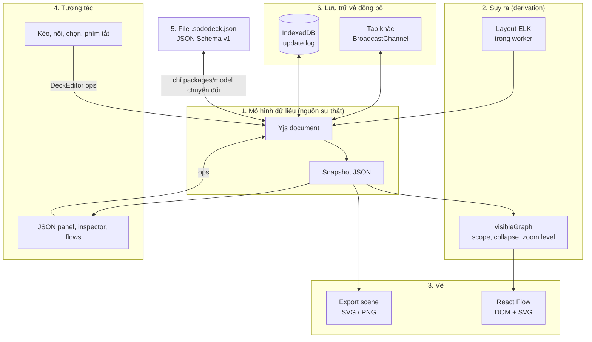

# Sổ tay nền tảng Diagram App

- **Cập nhật:** 2026-10-03
- **Dành cho:** founder (người mới với mảng diagram) và các agent làm việc trong repo.
- **Liên quan:** `docs/spec.md`, `docs/decisions/`, `docs/backlog.md`, `docs/performance.md`.

Một ứng dụng diagram gồm 6 tầng xếp chồng: **mô hình dữ liệu, layout, vẽ (rendering), tương tác,
lưu trữ/đồng bộ và file format**. Phần lớn quyết định sai đến từ việc chọn công nghệ ở một tầng
mà không thấy nó khóa các tầng khác. Sổ tay này giải thích từng tầng, các khái niệm và công nghệ
chính, và chỉ ra quyết định nào khó đảo ngược.

> Các thông tin về sản phẩm và thư viện bên ngoài (mục 8) là kiến thức chung tại thời điểm viết,
> chưa kiểm chứng từng nguồn. Hãy kiểm tra tài liệu chính thức trước khi ra quyết định dựa trên
> chúng.

## Mục lục

0. [Bức tranh tổng thể](#0-bức-tranh-tổng-thể)
1. [Mô hình dữ liệu](#1-mô-hình-dữ-liệu-diagram-là-một-đồ-thị-không-phải-một-bức-tranh)
2. [Các loại diagram và ký pháp](#2-các-loại-diagram-và-ký-pháp)
3. [Công nghệ vẽ](#3-công-nghệ-vẽ-dom-svg-canvas-webgl)
4. [Layout và routing](#4-layout-và-routing)
5. [Tương tác trên canvas](#5-tương-tác-trên-canvas)
6. [Local-first và cộng tác](#6-local-first-và-cộng-tác)
7. [File format và liên thông](#7-file-format-và-liên-thông)
8. [Bản đồ thị trường và thư viện](#8-bản-đồ-thị-trường-và-thư-viện)
9. [Các quyết định khó đảo ngược](#9-các-quyết-định-khó-đảo-ngược)
10. [Thuật ngữ](#10-thuật-ngữ)
11. [Lộ trình tự học](#11-lộ-trình-tự-học)

---

## 0. Bức tranh tổng thể



Mũi tên chỉ đi **một chiều qua model**: giao diện không bao giờ sửa trực tiếp những gì đang
hiển thị, mà gửi một thao tác (op) vào Yjs, rồi mọi view tự vẽ lại từ snapshot. Nhờ đó có thể
thay một tầng (ví dụ đổi renderer) mà không đụng đến các tầng khác.

Sododeck hiện dùng:

| Tầng        | Lựa chọn hiện tại                                | Ghi lại ở                  |
| ----------- | ------------------------------------------------ | -------------------------- |
| Mô hình     | Yjs document, id ổn định                         | ADR 0005, AGENTS.md rule 1 |
| Suy ra      | `visibleGraph`, snapshot tăng dần                | ADR 0006, 0011             |
| Layout      | ELK trong Web Worker, có pin vị trí              | ADR 0012                   |
| Vẽ          | React Flow (DOM + SVG); export vẽ từ scene riêng | ADR 0006, 0016             |
| Lưu trữ     | Dexie/IndexedDB, update log, sync nhiều tab      | ADR 0007                   |
| File format | JSON + JSON Schema v1, Zod sinh tự động          | ADR 0002, 0004, 0020       |

---

## 1. Mô hình dữ liệu: diagram là một đồ thị, không phải một bức tranh

Quyết định quan trọng nhất của một diagram app là lưu **ý nghĩa** (cái gì nối với cái gì) hay
chỉ lưu **hình vẽ** (hình chữ nhật ở toạ độ nào). Miro và Excalidraw lưu hình vẽ. Sododeck,
Structurizr và IcePanel lưu ý nghĩa, nên mới làm được flows, rules, semantic zoom và JSON.

| Khái niệm             | Nghĩa                                      | Ví dụ trong Sododeck                              |
| --------------------- | ------------------------------------------ | ------------------------------------------------- |
| Node (đỉnh)           | Một đối tượng: service, database, kho hàng | `nodes[]`, có `type` = kind                       |
| Edge (cạnh)           | Quan hệ giữa hai node, có hướng (A gọi B)  | `edges[]` với `from` / `to`                       |
| Port / handle         | Điểm neo trên node mà edge bám vào         | handle của React Flow, `route.fromSide` (017)     |
| Group / compound node | Node chứa node khác, tạo cây lồng nhau     | `groups[]`, `parent`, drill-in (010)              |
| Multigraph            | Hai node được nối bởi nhiều edge khác nhau | A gọi B qua HTTP và qua queue                     |
| Hyperedge             | Một cạnh nối nhiều hơn 2 node              | chưa hỗ trợ; thường mô phỏng bằng node trung gian |
| Flow / path           | Chuỗi edge có thứ tự, kể một câu chuyện    | `flows[]` với steps và branches                   |
| View / lens           | Một cách nhìn đã lọc trên cùng dữ liệu     | `views[]`, hidden/dimmed kinds                    |

**Ba nguyên tắc sống còn**

- **Id ổn định, không suy ra từ tên.** Đổi tên "Order Service" thành "Orders" không được làm
  gãy flow hay rule nào trỏ tới nó. Sai chỗ này thì mọi tính năng tham chiếu về sau đều mong manh.
- **Tách document model khỏi scene.** Document là sự thật (Yjs doc). Scene là thứ được tính ra
  để vẽ: vị trí đã layout, node nào đang hiện, edge nào gộp lại. Nếu để thư viện vẽ giữ một bản
  sao dữ liệu, bạn sẽ có hai sự thật và bug đồng bộ kéo dài mãi (ADR 0006).
- **Model trước, notation sau.** Cùng một model có thể vẽ thành C4, bảng, JSON hay Mermaid. Model
  càng giàu ý nghĩa thì càng làm được nhiều cách nhìn mà không phải đổi file format.

Câu hỏi nên tự hỏi trước mỗi tính năng: dữ liệu này là **document** (được lưu, export, undo), là
**view state** (lưu theo từng view), hay là **UI state** (mất khi reload)? ADR 0011 và 0012 là ví
dụ phân loại đúng.

---

## 2. Các loại diagram và ký pháp

Mỗi ký pháp (notation) trả lời một câu hỏi khác nhau. Sododeck hiện gần với **C4 + flow +
decision table**. Mở rộng sang miền khác (backlog 024) nghĩa là hỗ trợ thêm kind và level, chứ
không phải hỗ trợ trọn vẹn mọi ký pháp.

| Ký pháp                    | Trả lời câu hỏi                                     | Người dùng            | Liên quan Sododeck                             |
| -------------------------- | --------------------------------------------------- | --------------------- | ---------------------------------------------- |
| **C4 model**               | Hệ thống gồm những khối nào, ở 4 mức zoom           | Kiến trúc sư phần mềm | Level landscape → component chính là C4        |
| **Flowchart**              | Các bước và rẽ nhánh của một quy trình              | Mọi người             | Flows + branches                               |
| **Sequence diagram** (UML) | Ai gọi ai, theo thứ tự thời gian                    | Dev, kiến trúc sư     | Flow playback là một dạng sequence trên canvas |
| **State machine**          | Một đối tượng có những trạng thái và chuyển đổi nào | Dev, product          | Chưa có; có thể là một kind pack               |
| **ERD**                    | Bảng dữ liệu và quan hệ giữa chúng                  | Dev backend, data     | Chưa có                                        |
| **BPMN**                   | Quy trình nghiệp vụ chuẩn hoá, có lane và sự kiện   | Business analyst      | Ứng viên kind pack "business process"          |
| **DFD** (data flow)        | Dữ liệu chảy qua đâu, lưu ở đâu                     | Security, compliance  | Gần với flows hiện tại                         |
| **ArchiMate**              | Kiến trúc doanh nghiệp: business, app, hạ tầng      | Enterprise architect  | Quá nặng cho MVP                               |
| **Network / topology**     | Thiết bị, mạng và kết nối vật lý                    | DevOps, logistics     | Cần scale lớn (backlog 023)                    |
| **Decision table** (DMN)   | Với các đầu vào này thì kết quả là gì               | Business, dev         | `rules`, ADR 0009                              |

Bài học: **đừng tự đặt ký pháp mới nếu đã có chuẩn**. Người dùng đã quen C4 và BPMN; hãy dùng
đúng tên gọi và hình dạng của chúng, chỉ khác ở cách tương tác.

---

## 3. Công nghệ vẽ: DOM, SVG, Canvas, WebGL

Đây là tầng mà quyết định "đổi công nghệ" tốn kém nhất, vì hit-testing, text, accessibility và
export đều phụ thuộc vào nó.

| Công nghệ      | Cách hoạt động                           | Quy mô thoải mái (ước lượng)   | Điểm mạnh                                 | Điểm yếu                                         |
| -------------- | ---------------------------------------- | ------------------------------ | ----------------------------------------- | ------------------------------------------------ |
| **DOM (HTML)** | Mỗi node là một phần tử HTML             | vài trăm đến ~2.000 phần tử    | Text, form, CSS, a11y, React đầy đủ       | Mỗi phần tử tốn bộ nhớ và layout của trình duyệt |
| **SVG**        | Mỗi hình là một phần tử vector trong DOM | vài nghìn hình đơn giản        | Sắc nét mọi mức zoom, export dễ, CSS được | Vẫn là DOM, chậm khi nhiều phần tử               |
| **Canvas 2D**  | Vẽ pixel bằng lệnh, không có phần tử     | hàng chục nghìn hình           | Nhanh, bộ nhớ ít                          | Tự làm hit-test, text, a11y; phải vẽ lại khi đổi |
| **WebGL**      | Vẽ bằng GPU qua shader                   | hàng trăm nghìn đến hàng triệu | Cực nhanh cho nhiều hình giống nhau       | Text khó, code phức tạp, debug khó               |
| **WebGPU**     | API GPU thế hệ mới                       | như WebGL trở lên              | Hiện đại hơn, tính toán song song         | Hỗ trợ trình duyệt chưa đồng đều, ít thư viện    |

**Các kỹ thuật tăng tốc (không bắt buộc phải đổi công nghệ)**

- **Virtualization / culling:** chỉ gắn vào DOM những node nằm trong viewport. React Flow có sẵn
  `onlyRenderVisibleElements`.
- **Spatial index (R-tree, quadtree):** cấu trúc dữ liệu để trả lời nhanh câu hỏi "những node nào
  nằm trong hình chữ nhật này?". Dùng cho culling, marquee selection và hit-test.
- **Level of detail (LOD):** khi zoom xa thì vẽ node đơn giản hơn (chỉ một ô màu, không có chữ).
- **Semantic zoom:** khác LOD ở chỗ nội dung đổi theo **ý nghĩa**, không chỉ theo độ chi tiết (xa
  thì thấy hệ thống, gần thì thấy component). Sododeck đã có (ADR 0011).
- **Hybrid rendering:** Canvas/WebGL cho tầng nền (nhiều, ít tương tác) và DOM cho tầng tương tác
  (ít, cần text/form). Đây là cách nhiều sản phẩm lớn làm; backlog 023 đề xuất hướng này.
- **Off-main-thread:** layout, index và import chạy trong Web Worker để UI không bị giật.

**Nguyên tắc:** đo trước khi đổi (`docs/performance.md`). Thường thì chỗ chậm là do tính toán lại
và React re-render, không phải do DOM.

---

## 4. Layout và routing

**Layout** = tự đặt vị trí node. **Routing** = tự vẽ đường cho edge.

| Thuật toán                            | Ý tưởng                                                  | Hợp với                                       | Thư viện ví dụ      |
| ------------------------------------- | -------------------------------------------------------- | --------------------------------------------- | ------------------- |
| **Layered / Sugiyama** (hierarchical) | Xếp node thành các tầng theo hướng edge, giảm số lần cắt | Kiến trúc, flowchart, luồng có hướng          | ELK, dagre          |
| **Force-directed**                    | Node đẩy nhau như lò xo, edge kéo lại                    | Mạng lưới không có hướng rõ, khám phá dữ liệu | d3-force, Cytoscape |
| **Tree / radial**                     | Cây phân cấp, hoặc toả tròn từ gốc                       | Org chart, mind map                           | d3-hierarchy, ELK   |
| **Orthogonal**                        | Node trên lưới, edge chỉ đi ngang/dọc                    | Sơ đồ kỹ thuật gọn gàng                       | ELK, libavoid       |
| **Compound / nested**                 | Layout lồng nhau trong group                             | C4, group frames                              | ELK                 |

**Routing:** straight, **orthogonal** (elbow, như Sododeck hiện tại), **spline/curved**, và
**obstacle-avoiding** (đường tự tránh node, khó và tốn nhất).

**Edge bundling:** gom các edge đi cùng hướng thành "bó" như dây cáp để giảm rối khi có hàng
nghìn edge. Chỉ có ích khi zoom xa, và làm mất khả năng nhìn từng edge riêng.

**Các khái niệm hay bị bỏ qua**

- **Layout ổn định (stable / incremental):** thêm một node không được làm cả diagram nhảy lung
  tung. Người dùng nhớ vị trí bằng mắt (mental map); phá vỡ điều đó còn tệ hơn một layout xấu.
- **Pinning:** node người dùng đã tự đặt thì layout không được di chuyển (ADR 0012).
- **Auto vs manual:** công cụ vẽ tự do (Miro) để người dùng tự đặt vị trí; công cụ dạng code
  (Mermaid) luôn tự layout. Sododeck ở giữa: vừa tự layout, vừa cho kéo tay và pin. Đây là vị trí
  tốt nhưng khó làm đúng.

---

## 5. Tương tác trên canvas

| Khái niệm                  | Ý nghĩa                                                | Bẫy thường gặp                                              |
| -------------------------- | ------------------------------------------------------ | ----------------------------------------------------------- |
| **Viewport / camera**      | Phần canvas đang nhìn thấy: `x, y, zoom`               | Lưu viewport vào document khiến mỗi lần pan là một thay đổi |
| **Hệ toạ độ**              | Screen (pixel màn hình) và world/flow (toạ độ diagram) | Quên đổi toạ độ khi zoom khiến popover lệch                 |
| **Hit-testing**            | Xác định chuột đang trỏ vào cái gì                     | Với Canvas/WebGL phải tự viết                               |
| **Selection, marquee**     | Chọn một hoặc nhiều đối tượng, kéo vùng chọn           | Chọn node trong group, chọn edge bị che                     |
| **Snapping, guides**       | Hút vào lưới hoặc căn theo node khác                   | Snap quá mạnh gây khó chịu                                  |
| **Gesture và transaction** | Một thao tác kéo là một bước undo                      | Mỗi frame kéo tạo một bước undo                             |
| **Undo/redo**              | Theo từng tab/người, không theo toàn cục               | Khi cộng tác, undo nhầm thao tác của người khác             |
| **Keyboard và a11y**       | Dùng được bằng bàn phím, có screen reader              | Canvas/WebGL không có DOM thì screen reader không đọc được  |
| **Infinite canvas**        | Không có biên, pan/zoom tự do                          | Người dùng "lạc" nên cần minimap và fit view                |
| **Modes**                  | Chế độ edit, flow, present                             | Quá nhiều mode làm người dùng bối rối                       |

---

## 6. Local-first và cộng tác

**Local-first** (khái niệm của Ink & Switch): dữ liệu nằm trên máy người dùng trước, server (nếu
có) chỉ để đồng bộ. Ưu điểm: nhanh, chạy offline, riêng tư. Đây là lựa chọn cốt lõi của Sododeck
(không backend, không gửi nội dung ra ngoài).

| Khái niệm                      | Nghĩa                                                                                        |
| ------------------------------ | -------------------------------------------------------------------------------------------- |
| **CRDT**                       | Cấu trúc dữ liệu mà hai bản sửa song song luôn gộp lại được, không cần server làm trọng tài  |
| **OT** (Operational Transform) | Cách cũ hơn (Google Docs): server biến đổi thao tác để gộp. Cần server trung tâm             |
| **Yjs**                        | Thư viện CRDT phổ biến và nhanh cho JavaScript; Sododeck dùng                                |
| **Automerge**                  | CRDT khác, mô hình giống JSON, có lịch sử đầy đủ                                             |
| **Update / state vector**      | Yjs lưu thay đổi dưới dạng các update nhị phân; state vector cho biết một bên đã có những gì |
| **Awareness / presence**       | Con trỏ và selection của người khác (không phải document data)                               |
| **Compaction / GC**            | Gộp log update để file không phình vô hạn                                                    |
| **Provider**                   | Lớp kết nối Yjs với nơi lưu (IndexedDB) hoặc kênh truyền (WebSocket, BroadcastChannel)       |

**Những điều nên biết sớm**

- CRDT gộp được về mặt **cấu trúc**, nhưng không đảm bảo **ý nghĩa** hợp lệ: hai người cùng xoá
  và cùng nối vào một node vẫn có thể tạo ra edge trỏ tới node không tồn tại. Vì vậy cần kiểm tra
  tính toàn vẹn (integrity) và problems (ADR 0013).
- Sửa **tại chỗ** (patch field) thì gộp tốt; **thay cả object** hoặc lưu theo **vị trí trong mảng**
  thì gộp tệ.
- Cộng tác realtime cần server hoặc kênh P2P, và đó là "network với nội dung". Khi làm cần một ADR
  mới, vì AGENTS.md rule 5 hiện cấm.

### Từ lưu trong trình duyệt lên server: vì sao gần như không phải viết lại phần lưu trữ

**Sododeck lưu deck thế nào hôm nay (ADR 0007).** Deck không được lưu thành một file JSON to rồi
ghi đè mỗi lần sửa. Mỗi thao tác (kéo card, đổi tiêu đề) sinh ra một **update**: một gói nhị phân
nhỏ mô tả đúng thay đổi đó. Các update được **nối thêm** vào bảng `updates` trong IndexedDB, giống
một cuốn nhật ký chỉ viết thêm, không sửa trang cũ. Mở deck = đọc lại toàn bộ nhật ký và áp lên
một tài liệu Yjs rỗng. Khi nhật ký dài quá 200 dòng, các update được **gộp** (compaction) thành
một dòng duy nhất.

```text
Hôm nay (một máy)                         Sau này (có server)

 Tab A ──update──► IndexedDB              Máy A ──update──► Server ──update──► Máy B
   │                                        │                 │
   └──update──► BroadcastChannel ──► Tab B  └── IndexedDB      └── Kho lưu (DB/S3)
```

**Vì sao điều này hợp với server.** Mọi server đồng bộ Yjs đều làm đúng ba việc với cùng loại
update đó:

1. **Nhận update** từ một client và **lưu** nó (nối vào log hoặc gộp vào bản đã lưu).
2. **Phát lại** update cho các client khác đang mở cùng deck.
3. Khi một client kết nối lại, hai bên **trao đổi state vector** (bảng "tôi đã có đến đâu") rồi chỉ
   gửi phần còn thiếu. Sododeck đã làm đúng bước này giữa các tab (`hello` / `diff` trong
   `deck-channel.ts`).

Nói cách khác, ở Sododeck **tab kia** và **server** nhận cùng một loại dữ liệu. Thay
`BroadcastChannel` bằng một kết nối WebSocket tới server là đủ để đồng bộ giữa các máy. IndexedDB
vẫn giữ lại làm bộ nhớ đệm offline: mất mạng vẫn sửa được, có mạng lại thì tự đồng bộ phần còn
thiếu.

**Các lựa chọn server** (kiến thức chung, cần kiểm tra tài liệu chính thức trước khi chọn):

| Lựa chọn                  | Là gì                                                                             |
| ------------------------- | --------------------------------------------------------------------------------- |
| **y-websocket**           | Server mẫu tối giản của chính Yjs. Tốt để thử, thiếu xác thực và lưu trữ bền vững |
| **Hocuspocus**            | Server Node.js dựng trên Yjs, có sẵn hook xác thực, lưu vào database, webhook     |
| **y-redis**               | Kiến trúc dùng Redis để chạy nhiều server song song, cho tải lớn                  |
| **PartyKit / y-partykit** | Chạy mỗi deck như một "phòng" trên hạ tầng edge, ít phải tự vận hành              |
| **Dịch vụ có sẵn**        | Ví dụ Liveblocks, Y-Sweet: trả phí, không phải tự vận hành server                 |
| **Tự viết**               | Một WebSocket server nhỏ: nhận update, lưu vào Postgres/S3, phát lại cho cả phòng |

**Những gì vẫn phải tự làm khi có server**

- **Id deck toàn cục.** Deck đã dùng UUID làm id trong thư viện, nên dùng luôn làm tên phòng
  trên server.
- **Đăng nhập và quyền.** Ai được mở, ai được sửa. Quyền chỉ đặt được cho **cả deck**, vì mỗi
  deck là một tài liệu Yjs.
- **Gộp log phía server** để kho lưu không phình vô hạn, giống compaction ở trình duyệt.
- **Kiểm tra hợp lệ.** Server không đọc được ý nghĩa của update nhị phân, nên mỗi client phải tự
  kiểm tra và sửa khi nhận update của người khác (ví dụ edge trỏ tới node đã bị xoá).
- **Một ADR mới** cho phép gửi nội dung ra mạng (AGENTS.md quy tắc 5).

**Ba điểm cần sửa trước khi cộng tác thật đã xong ở 036** (ADR 0021): văn bản dài là `Y.Text`
(hai người cùng gõ không mất chữ); danh sách lưu theo id kèm khoá thứ tự (sắp xếp lại không làm
mất chỉnh sửa của người khác, không nhân đôi phần tử); và sau mỗi update từ bên ngoài, problems
được tính lại còn các mục view trỏ vào thứ đã bị xoá được tự dọn. Định dạng file `.sododeck.json`
không đổi, chỉ cách lưu Yjs bên trong đổi. Deck lưu bởi bản build trước 036 không mở được: xuất
ra `.sododeck.json` ở bản cũ rồi nhập lại.

---

## 7. File format và liên thông

| Khái niệm                     | Nghĩa                                                                  | Sododeck                         |
| ----------------------------- | ---------------------------------------------------------------------- | -------------------------------- |
| **JSON Schema**               | Hợp đồng mô tả file hợp lệ; sinh được type và validator                | `packages/schema/schema/v1.json` |
| **Versioning**                | `version` (major, thay đổi phá vỡ) và `revision` (thêm field tuỳ chọn) | ADR 0002, 0020                   |
| **Migration**                 | Code chuyển file cũ sang định dạng mới                                 | `packages/model`                 |
| **Forward / backward compat** | Bản cũ đọc file mới / bản mới đọc file cũ                              | ADR 0020                         |
| **Round-trip lossless**       | Import rồi export ra đúng file ban đầu                                 | Có test                          |
| **Diagram-as-code**           | Viết diagram bằng văn bản: Mermaid, PlantUML, D2, Structurizr DSL      | Backlog 026                      |
| **Export**                    | Ảnh (PNG raster, SVG vector), PDF, hoặc sang định dạng tool khác       | ADR 0016                         |

**Vì sao file format là tài sản dài hạn:** người dùng có thể bỏ app, nhưng file thì ở lại trong
git, trong wiki, trong AI prompt. Một schema rõ ràng, được công bố và ổn định chính là thứ giúp
AI (backlog 027), CLI và import/export hoạt động. Mọi thay đổi schema đều phải cân nhắc như thay
đổi API công khai.

---

## 8. Bản đồ thị trường và thư viện

### Sản phẩm (phân theo cách lưu dữ liệu)

| Nhóm                         | Sản phẩm tiêu biểu                                      | Lưu gì                  | Điểm mạnh                                  | Điểm yếu so với Sododeck                  |
| ---------------------------- | ------------------------------------------------------- | ----------------------- | ------------------------------------------ | ----------------------------------------- |
| Bảng trắng tự do             | Miro, FigJam, Excalidraw, tldraw                        | Hình vẽ                 | Nhanh, tự do, cộng tác tốt                 | Không có ý nghĩa: không flow, không query |
| Công cụ vẽ diagram tổng quát | draw.io (diagrams.net), Lucidchart, Visio               | Hình vẽ + shape library | Nhiều ký pháp, quen thuộc với doanh nghiệp | Nặng, model yếu, khó giữ đồng bộ          |
| Diagram-as-code              | Mermaid, PlantUML, D2, Structurizr                      | Văn bản / model         | Nằm trong git, AI viết được                | Layout tự động khó chỉnh, ít tương tác    |
| Công cụ kiến trúc dạng model | IcePanel, Structurizr, Ilograph                         | Model C4                | Nhiều view trên một model                  | Cứng nhắc, gắn chặt với C4                |
| Công cụ AI + diagram         | Eraser, Whimsical AI, các tính năng AI của draw.io/Miro | Tuỳ sản phẩm            | Sinh nhanh từ prompt                       | Thường gửi nội dung lên server            |

Vị trí Sododeck: **model giàu ý nghĩa như nhóm kiến trúc, tương tác tự do như bảng trắng, file
thân thiện với code và AI như diagram-as-code, và local-first**. Rủi ro là ở giữa nhiều nhóm thì
dễ bị so sánh với nhóm mạnh nhất ở từng mặt.

### Thư viện kỹ thuật

| Thư viện                    | Dùng cho                             | Công nghệ vẽ       | Lưu ý giấy phép (kiểm tra lại)              |
| --------------------------- | ------------------------------------ | ------------------ | ------------------------------------------- |
| **React Flow (xyflow)**     | Node-based editor trong React        | DOM + SVG          | MIT; Sododeck đang dùng                     |
| **tldraw SDK**              | Infinite canvas đầy đủ               | DOM + SVG + canvas | Giấy phép riêng, bản thương mại cần license |
| **JointJS / JointJS+**      | Diagram doanh nghiệp                 | SVG                | Core MPL; bản + thương mại                  |
| **GoJS**                    | Diagram đầy đủ tính năng             | Canvas             | Thương mại                                  |
| **Cytoscape.js**            | Phân tích và hiển thị đồ thị         | Canvas             | MIT                                         |
| **Sigma.js + graphology**   | Đồ thị rất lớn                       | WebGL              | MIT                                         |
| **PixiJS**                  | Engine vẽ 2D tổng quát               | WebGL / WebGPU     | MIT                                         |
| **Konva**                   | Canvas 2D có scene graph và sự kiện  | Canvas 2D          | MIT                                         |
| **ELK (elkjs)**             | Layout layered, orthogonal, compound | —                  | EPL; Sododeck đang dùng                     |
| **dagre**                   | Layout layered đơn giản              | —                  | MIT                                         |
| **d3-force / d3-hierarchy** | Force layout, cây                    | —                  | ISC                                         |
| **rbush**                   | R-tree trong JavaScript              | —                  | MIT                                         |
| **Yjs / Automerge**         | CRDT                                 | —                  | MIT                                         |
| **Monaco**                  | Editor code (JSON panel)             | —                  | MIT                                         |

**Giấy phép là quyết định khó đảo ngược:** Sododeck là closed source và thương mại, nên mọi thư
viện GPL/AGPL hoặc có điều khoản "phải có watermark" cần xem kỹ trước khi dùng (AGENTS.md: hỏi
trước khi thêm runtime dependency).

---

## 9. Các quyết định khó đảo ngược

Xếp từ khó đảo ngược nhất. "Xem lại khi" là tín hiệu nên mở lại quyết định.

| Quyết định                           | Vì sao khó đảo ngược                                 | Sododeck hiện tại                           | Xem lại khi                                                 |
| ------------------------------------ | ---------------------------------------------------- | ------------------------------------------- | ----------------------------------------------------------- |
| Lưu ý nghĩa hay lưu hình vẽ          | Quyết định mọi tính năng về sau                      | Ý nghĩa (graph model)                       | Không nên đổi                                               |
| File format và cách versioning       | File đã nằm trên máy người dùng, trong git, trong AI | JSON Schema v1, strict, revision (ADR 0020) | Trước mỗi thay đổi schema                                   |
| Nguồn sự thật và mô hình đồng bộ     | Đổi sau thì phải viết lại lưu trữ và mọi view        | Yjs (CRDT), local-first                     | Khi làm cộng tác qua server                                 |
| Id và tham chiếu                     | Id sai thì dữ liệu cũ gãy                            | Id ổn định, không suy từ tên                | Không nên đổi                                               |
| Miền nghiệp vụ (kind cố định hay mở) | Enum cố định đi vào schema, icon, rules, views       | 6 kind cố định                              | Trước khi có nhiều người dùng ngoài kiến trúc (backlog 024) |
| Công nghệ vẽ                         | Hit-test, text, a11y, export đều phụ thuộc           | React Flow; export vẽ từ scene riêng        | Khi số đo cho thấy không đạt target (backlog 023)           |
| Giấy phép thư viện                   | Gỡ một thư viện lõi rất tốn kém                      | Chỉ dùng MIT/EPL                            | Mỗi lần thêm dependency                                     |
| Có backend / AI server hay không     | Thay đổi cam kết riêng tư và cách bán sản phẩm       | Không backend, không gửi nội dung           | Khi làm cộng tác, chia sẻ link, AI trong app                |

**Cách tránh quyết định sai**

1. Viết ADR cho mọi quyết định ở bảng trên, kể cả khi quyết định là "chưa làm".
2. Giữ ranh giới giữa các tầng (mục 0). Ranh giới tốt biến quyết định "khó đảo ngược" thành
   "đảo ngược được với chi phí vừa phải".
3. Đo trước khi tối ưu; kiểm chứng nhu cầu bằng một deck thật trước khi mở rộng miền.
4. Nghi ngờ các đề xuất dùng nhiều từ khoá kỹ thuật (WebGL, R-tree, edge bundling) mà không kèm
   số đo hoặc người dùng cụ thể.

---

## 10. Thuật ngữ

| Thuật ngữ          | Giải thích ngắn                                                                     |
| ------------------ | ----------------------------------------------------------------------------------- |
| ADR                | Architecture Decision Record: ghi lại một quyết định, bối cảnh và lựa chọn thay thế |
| Bounding box       | Hình chữ nhật nhỏ nhất bao quanh một đối tượng                                      |
| C4                 | Mô hình kiến trúc 4 mức: Context, Container, Component, Code                        |
| Canvas (HTML)      | Phần tử `<canvas>` để vẽ pixel bằng JavaScript                                      |
| Compound graph     | Đồ thị có node lồng trong node                                                      |
| CRDT               | Conflict-free Replicated Data Type, dữ liệu gộp được không xung đột                 |
| Culling            | Bỏ qua không vẽ những gì ngoài màn hình                                             |
| DAG                | Directed Acyclic Graph: đồ thị có hướng không có vòng                               |
| Derived state      | Dữ liệu tính ra từ nguồn sự thật, không lưu riêng                                   |
| Edge bundling      | Gom nhiều edge thành bó để giảm rối                                                 |
| FPS / frame budget | Số khung hình mỗi giây; 60 fps nghĩa là mỗi khung có khoảng 16,7 ms                 |
| Hit-testing        | Xác định điểm chuột trúng đối tượng nào                                             |
| Layout             | Thuật toán đặt vị trí node                                                          |
| LOD                | Level of detail: vẽ đơn giản hơn khi ở xa                                           |
| Local-first        | Dữ liệu ở máy người dùng trước, server chỉ để đồng bộ                               |
| Main thread        | Luồng chính của trình duyệt; chặn nó thì UI bị đứng                                 |
| Mental map         | Trí nhớ về vị trí của người dùng; layout ổn định để giữ nó                          |
| Minimap            | Bản đồ thu nhỏ toàn bộ canvas                                                       |
| Notation           | Ký pháp: quy ước hình dạng và ý nghĩa (C4, BPMN, UML)                               |
| Orthogonal routing | Edge chỉ đi ngang và dọc                                                            |
| Quadtree / R-tree  | Cấu trúc chỉ mục không gian để tìm nhanh theo vùng                                  |
| Rasterize          | Chuyển vector thành pixel (SVG → PNG)                                               |
| Round-trip         | Chuyển đổi qua lại không mất dữ liệu                                                |
| Scene graph        | Cây các đối tượng cần vẽ, đã có vị trí và style                                     |
| Semantic zoom      | Zoom đổi nội dung theo ý nghĩa, không chỉ phóng to                                  |
| Snapshot           | Bản JSON thường của document tại một thời điểm                                      |
| Sugiyama           | Thuật toán layout theo tầng cho đồ thị có hướng                                     |
| Viewport           | Vùng đang nhìn thấy trên canvas                                                     |
| Virtualization     | Chỉ tạo phần tử cho những gì đang thấy                                              |
| Web Worker         | Luồng chạy nền để tính toán nặng                                                    |
| WebGL / WebGPU     | API dùng GPU để vẽ trong trình duyệt                                                |
| Yjs                | Thư viện CRDT mà Sododeck dùng làm nguồn sự thật                                    |

---

## 11. Lộ trình tự học

Mỗi bước khoảng một buổi. Đọc theo thứ tự, vì bước sau dựa trên bước trước.

1. **Kiến trúc của chính Sododeck.** Đọc `AGENTS.md`, rồi ADR 0005, 0006, 0011, 0016, 0020. Mục
   tiêu: tự vẽ lại sơ đồ ở mục 0 mà không cần nhìn.
2. **C4 model.** Trang chính thức c4model.com. Mục tiêu: hiểu vì sao Sododeck có 4 level và
   chúng khác gì so với "zoom to nhỏ".
3. **Local-first và CRDT.** Bài "Local-first software" của Ink & Switch, rồi phần docs "Yjs
   fundamentals" trên docs.yjs.dev. Mục tiêu: giải thích được vì sao hai tab sửa cùng lúc mà
   không mất dữ liệu.
4. **Rendering và hiệu năng.** Docs React Flow (reactflow.dev), mục performance; thử bật
   `onlyRenderVisibleElements` và chạy `pnpm bench`. Mục tiêu: đọc được bảng bench và biết số
   nào quan trọng.
5. **Layout.** Trang ELK (eclipse.dev/elk) và demo ELK; so sánh layered với force-directed trên
   cùng một deck. Mục tiêu: biết khi nào auto-layout giúp và khi nào nó phá mental map.
6. **Đối thủ.** Dùng thật Excalidraw, tldraw, draw.io, IcePanel, Structurizr, Mermaid mỗi cái 30
   phút, vẽ cùng một hệ thống. Ghi lại 3 điều mỗi tool làm tốt hơn Sododeck.
7. **Ký pháp mở rộng.** Đọc nhanh BPMN và state machine. Mục tiêu: quyết định kind pack nào đáng
   làm đầu tiên (backlog 024).
8. **Sách tham khảo (khi cần đào sâu):** "Graph Drawing: Algorithms for the Visualization of
   Graphs" (Di Battista và cộng sự) cho layout; "Designing Data-Intensive Applications"
   (Kleppmann) cho dữ liệu và đồng bộ.

**Thói quen giúp tránh quyết định sai:** trước mỗi quyết định lớn, hỏi agent ba câu:
"quyết định này nằm ở tầng nào?", "nó khoá tầng nào khác?", "số đo hay người dùng nào chứng
minh là cần?".
