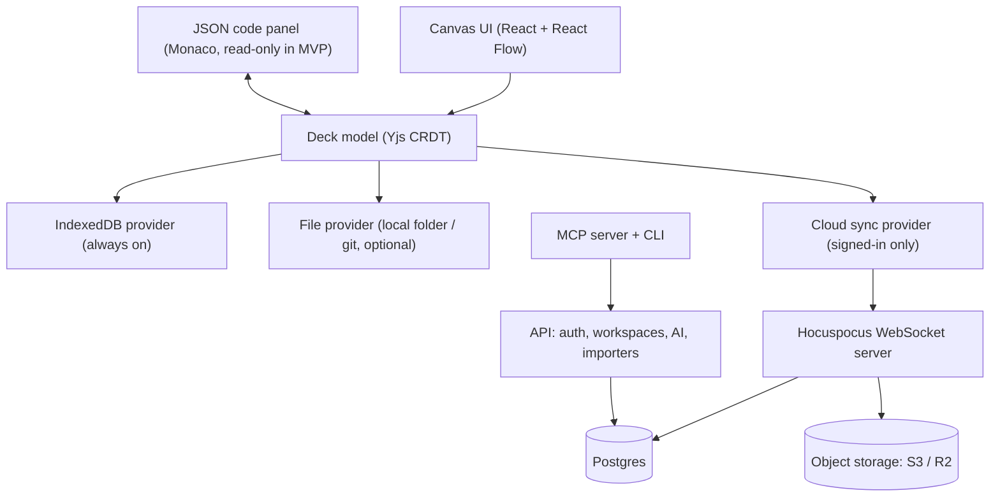

# Sododeck — Product Specification

Sep 26, 2026 · @Manh Pham

## 1. Overview

Sododeck is an interactive, editable architecture workspace where diagrams are a living data model, not a static picture. One model of nodes, edges, flows, rules and notes powers every view: infrastructure, a single feature, or the whole system.

**One-line pitch:** "The architecture map you can click, trace, edit and annotate — from a blank canvas or from your codebase."

**Sododeck is:**

- A canvas plus a text model (JSON) that stay in sync (read-only JSON view in the MVP; two-way editing later).
- A place where business flows are first-class: select a flow and watch it light up end to end.
- A knowledge base attached to the diagram: rules, notes, comments, sticky notes.
- Local-first: usable in the browser without an account, with cloud sync for signed-in users.

**Sododeck is not:**

- A one-shot diagram generator that outputs static HTML or images.
- A full developer portal or service catalog (it integrates with Backstage instead of replacing it).
- A general whiteboard; every shape carries architectural meaning.

## 2. Problem

Existing diagram tools break down exactly where architecture gets hard: large systems, many flows and complex business rules.

| # | Pain point | Impact |
| --- | --- | --- |
| P1 | Output is static; no interaction | Cannot explore, filter or drill into a diagram |
| P2 | Complex systems become a tangle of connectors | 50–100 node diagrams are unreadable and get abandoned |
| P3 | Generated diagrams cannot be edited by hand | One wrong edge in a 100-node diagram cannot be fixed without regenerating |
| P4 | A feature with 10–20 flows shows as one blob | Nobody can see which path a specific flow takes from start to end |
| P5 | No blank-canvas drawing | Architects cannot design a solution before code or a written description exists |
| P6 | Single-purpose tools | Infra, feature-level and system-level diagrams live in different tools and drift apart |
| P7 | No place for rules and context | Complex rules (e.g. logistics COD, returns, retries) are forgotten or live in scattered docs |
| P8 | No free-form annotations | Reminders and open questions have nowhere to live on the diagram |

The common root cause: the diagram is treated as a rendered picture instead of a structured, editable model.

## 3. Target users and use cases

The primary user is the technical architect in a flow-heavy domain such as logistics; everyone else reads what the architect maintains.

| Persona | Main job | What they need from Sododeck |
| --- | --- | --- |
| Technical / solution architect (primary) | Design and own the system map | Blank-canvas drawing, multi-level views, flows, ADRs, as-is vs to-be |
| Backend / platform engineer | Build and change services | Accurate edges, contracts, impact analysis, import from code and IaC |
| Business analyst / product owner | Define features and rules | Swimlane view, business rules, notes, rule simulator |
| QA / tester | Verify flows | Test scenarios generated from flows, coverage per step |
| DevOps / SRE | Run the infrastructure | Infra view, runtime overlay, incident mode |
| New joiner | Learn the system | Guided tours, glossary, read-only links |

**Key use cases**

1. Design a new technical solution on a blank canvas before any code exists.
2. Document a feature with many flows, e.g. *Delivery*: create order → route → pickup → deliver → COD reconciliation; failed delivery → reschedule → return; cross-dock transfer; address change mid-route; cancel after pickup.
3. Trace one flow end to end with highlight and animation while explaining it to a colleague.
4. Keep complex business rules (thresholds, retries, SLAs) attached to the exact step they govern.
5. Draw infrastructure (cloud, Kubernetes, queues, databases) as a separate view of the same model.
6. Assess the impact of changing one service across all flows.
7. Onboard a new engineer with a guided tour of the system.

## 4. Competitive landscape

No existing tool combines hand-editable canvas, first-class flows and an attached rule/knowledge layer; that combination is Sododeck's wedge.

| Tool | Strength | Gap for our users |
| --- | --- | --- |
| [archify](https://github.com/tt-a1i/archify) | Generates architecture diagrams quickly | Static output; no manual editing, flows or notes |
| [effective-html](https://github.com/plannotator/effective-html) | Rich generated HTML explanations | One-shot generation; not a maintained, editable model |
| [EventCatalog](https://www.eventcatalog.dev/) | Deep documentation of event-driven systems, domains and services | Docs-as-code first; limited canvas editing and flow tracing; event-centric |
| [Backstage](https://github.com/backstage/backstage) | Service catalog and developer portal | Not a diagramming tool; heavy to run |
| Excalidraw / draw.io | Free drawing, easy to use | No semantic model; drawings go stale; no flows or rules |

Positioning: **Sododeck is to architecture what Figma is to UI**: a shared, editable source of truth, with import from EventCatalog and Backstage rather than competing with them.

*Comparison reflects general product knowledge as of this date, not a detailed feature audit.*

## 5. Product principles

Seven principles decide trade-offs when requirements conflict.

1. **Model first, picture second.** Every shape is data; views render the model.
2. **Humans stay in control.** Anything generated (by AI, import or drift detection) is a proposal the user can review, edit or reject.
3. **Never show everything at once.** Default to the current level, focus and flow; complexity is revealed on demand.
4. **Flows are first-class.** A flow is an object with steps, conditions and rules, not a coloured line.
5. **Knowledge lives next to the thing it describes.** Rules, notes and decisions attach to nodes, edges and steps.
6. **Local-first, no lock-in.** Works without an account; data always exports to open formats (JSON, Mermaid, PNG/SVG).
7. **Free to draw, pay to collaborate.** Core modelling is free; paid tiers cover server cost and teamwork.

## 6. Core concepts and data model

A workspace holds decks; each deck is one model with many views over it.

| Concept | Definition | Key fields |
| --- | --- | --- |
| Workspace | Container for a team or a guest's local library | members, plan, settings |
| Deck | One architecture model (a system or product) | name, description, tags |
| Node | A thing: actor, service, component, database, queue, external partner, cloud resource | id, type, title, level, parent, owner, tags, description |
| Group | Collapsible set of nodes (domain, bounded context, VPC) | id, title, children |
| Edge | A relationship between two ends, each a node or a group | from, to, protocol (HTTP, gRPC, event), label, contract |
| View | A saved lens: filter, level, layout and positions | type (infra, feature, system, custom), includes, pinned positions |
| Feature | A business capability grouping flows | title, description, owner |
| Flow | Ordered steps over existing edges | feature, title, steps, trigger, outcome |
| Step | One hop in a flow | edge, order, condition, branch, SLA, rule refs, payload |
| Rule | Business rule or decision table | title, table (conditions → actions), notes |
| Entity state machine | Lifecycle of a business entity | states, transitions (linked to flows) |
| Note / Comment / Sticky | Knowledge placed freely on the canvas; a connector can link it to a card (ADR 0041) | body (markdown), position, author, resolved |
| ADR | Architecture decision record | context, decision, consequences, status |

**Storage format (example: delivery.sododeck; older `.sododeck.json` and `.json` files also open)**

```json
{
  "$schema": "https://sododeck.com/schema/v1.json",
  "version": 1,
  "name": "Delivery",
  "nodes": [
    { "id": "routing-svc", "type": "service", "title": "Routing Service", "level": "container", "group": "oms" },
    { "id": "return-svc", "type": "service", "title": "Return Service", "level": "container", "group": "oms", "description": "Owns returns" }
  ],
  "groups": [{ "id": "oms", "title": "Order management" }],
  "edges": [
    { "id": "e7", "from": "routing-svc", "to": "return-svc", "protocol": "event", "label": "DeliveryFailed (Kafka)" }
  ],
  "views": [{ "id": "system", "type": "system", "title": "System", "subtitleField": "tech" }],
  "features": [{ "id": "delivery", "title": "Delivery" }],
  "flows": [
    {
      "id": "delivery-fail-return",
      "title": "Failed delivery -> Return",
      "feature": "delivery",
      "steps": [
        { "id": "s1", "edge": "e7", "condition": "fail_count >= 3", "sla": "24h", "rules": ["R-12"] }
      ]
    }
  ],
  "rules": {
    "R-12": {
      "title": "Return to sender",
      "hitPolicy": "first",
      "inputs": [{ "id": "fails", "label": "Failed attempts" }, { "id": "cod", "label": "Cash on delivery" }],
      "outputs": [{ "id": "action", "label": "Action" }],
      "rows": [{ "id": "r1", "when": [">= 3", "true"], "then": ["Return, cancel COD, notify shipper"] }]
    }
  },
  "stickies": [{ "id": "n1", "text": "Confirm warehouse SLA with ops", "position": { "x": 40, "y": 400 } }]
}
```

Ids are stable across renames so views, flows and comments never break when a node is edited. The full field list is `packages/schema/schema/v1.json`; the decisions behind its shape are in ADR 0004.

**File format decision: JSON, not YAML.** The file is written and read mostly by machines (app, CLI, MCP server, AI agents), JSON is native to the whole stack, validates with JSON Schema, and avoids YAML pitfalls such as indentation errors and `no`/`NO` or `010` being silently re-typed. Conventions:

- Strict JSON with `$schema` and `version` in every file.
- Keys written in a fixed order, pretty-printed with one object per line, for readable git diffs.
- One file per feature (e.g. `delivery.sododeck`, `returns.sododeck`) to limit merge conflicts.
- Long markdown notes may live in sibling `.md` files referenced by path.
- YAML is accepted on import and may be offered as an optional editor view (V2); storage stays JSON.

## 7. Functional requirements — modelling

Priority: **P0** = MVP, **P1** = V2, **P2** = V3.

### 7.1 Canvas and editing

| ID | Requirement | Priority |
| --- | --- | --- |
| C-1 | Draw from a blank canvas with a node palette (service, DB, queue, gateway, actor, partner, cloud icons for AWS/GCP/Azure) | P0 |
| C-2 | Drag an edge endpoint to reconnect it; edit edge label, protocol and direction inline | P0 |
| C-3 | Command palette (Ctrl/Cmd+K) to find and jump to any node, edge, flow or rule | P0 |
| C-4 | Auto-layout (ELK) that respects pinned positions | P0 |
| C-5 | JSON code panel in sync with the canvas: read-only view of the selection and the whole deck (P0). Editing from JSON with JSON Schema autocomplete and two-way sync is deferred (P1, founder decision 2026-09-27) | P0 |
| C-6 | Undo/redo, multi-select, bulk edit (type, tags, owner) | P0 |
| C-7 | Validation: broken flows, duplicate edges, broken references (unconnected components are allowed, 2026-09-28) | P0 |
| C-8 | Template library (logistics: last-mile, cross-dock, returns, COD reconciliation; patterns: saga, outbox, CQRS) | P1 |

### 7.2 Views and scale

| ID | Requirement | Priority |
| --- | --- | --- |
| V-1 | Semantic zoom across 4 levels: landscape → system → container → component; double-click to drill down | P0 |
| V-2 | Collapsible groups; edges inside collapse into one edge with a count (e.g. ×12) | P0 |
| V-3 | Focus mode: a mode turned on with F or the toolbar; inside it, the hovered or selected node dims everything not connected to it (outside it nothing dims) | P0 |
| V-4 | Saved views (infra, feature, system, custom) over the same model; edits propagate | P0 |
| V-5 | Role-based views: business, technical, infra layers shown or hidden | P1 |
| V-6 | Alternate renderings of a flow: sequence diagram and swimlane by actor | P1 |
| V-7 | Entity state machine view linked to flows | P1 |

### 7.3 Flows

| ID | Requirement | Priority |
| --- | --- | --- |
| F-1 | Create a flow by clicking existing edges in order; no redrawing | P0 |
| F-2 | Select a flow: its path highlights, an animated token travels start to end, other elements dim | P0 |
| F-3 | Step player (previous / next / play) with a side panel showing the step's condition, rules, payload and SLA | P0 |
| F-4 | Branches with conditions; error paths styled differently | P0 |
| F-5 | Flow list per feature, with search and filter | P0 |
| F-6 | Compare two flows: overlay and show where they diverge | P1 |
| F-7 | Flow × node matrix for impact analysis | P1 |

### 7.4 Knowledge layer

| ID | Requirement | Priority |
| --- | --- | --- |
| K-1 | Title, markdown description, owner, tags and links on every node, edge, flow and step | P0 |
| K-2 | Business rules as decision tables, reusable across steps | P0 |
| K-3 | Sticky notes on the canvas, placed freely; link one to a card with a connector (pinning removed, ADR 0041) | P0 |
| K-4 | Global search across titles, notes and rules | P0 |
| K-5 | Comment threads with resolve and @mention (signed-in) | P1 |
| K-6 | ADRs attached to nodes and edges | P1 |
| K-7 | Domain glossary with hover tooltips | P1 |
| K-8 | Guided tours for onboarding | P2 |

## 8. Functional requirements — intelligence and integration

### 8.1 Analysis and simulation

| ID | Requirement | Priority |
| --- | --- | --- |
| A-1 | Rule simulator: enter inputs (e.g. COD 6M VND, remote area, 2 failures) and see which branch each flow takes; flag conflicting or missing rules | P1 |
| A-2 | What-if: disable a node (e.g. carrier API down) and highlight broken flows and available fallbacks | P1 |
| A-3 | Impact analysis: list flows, rules, owners and tests affected by a node or edge | P1 |
| A-4 | SLA per step; total flow duration, critical path, cut-off warnings | P1 |

### 8.2 Quality and traceability

| ID | Requirement | Priority |
| --- | --- | --- |
| Q-1 | Generate test scenarios (happy, negative, boundary) from flow branches and rules | P1 |
| Q-2 | Map test cases to steps; show coverage and highlight untested steps | P2 |
| Q-3 | Link Jira tickets and requirements to steps, rules and nodes | P2 |
| Q-4 | Architecture linter with custom rules (e.g. no cross-service DB access; every COD flow passes Audit) | P2 |

### 8.3 Time and decisions

| ID | Requirement | Priority |
| --- | --- | --- |
| T-1 | Version history with visual diff and restore | P1 |
| T-2 | As-is vs to-be architecture with migration phases | P2 |
| T-3 | Time-travel slider across versions | P2 |

### 8.4 Runtime

| ID | Requirement | Priority |
| --- | --- | --- |
| R-1 | OpenTelemetry/Jaeger overlay: volume, latency, error rate per edge | P2 |
| R-2 | Detect undocumented paths observed in real traces | P2 |
| R-3 | Incident mode: highlight failing service, affected flows, owners and runbooks | P2 |
| R-4 | Cost overlay on infra views | P2 |

### 8.5 Import and export

| ID | Requirement | Priority |
| --- | --- | --- |
| I-1 | Export: `.sododeck` JSON, PNG, SVG, PDF, Mermaid | P0 |
| I-2 | Import: YAML, Mermaid (flowchart and sequence diagram: done in 056), draw.io | P1 |
| I-3 | Import: OpenAPI, AsyncAPI, Terraform, Kubernetes manifests | P1 |
| I-4 | Import from codebase via static analysis + AI | P1 |
| I-5 | Import from EventCatalog and Backstage `catalog-info.yaml` | P2 |
| I-6 | Drift detection: propose diagram changes when code or IaC changes; user approves | P2 |
| I-7 | Embed read-only views in Confluence and Notion | P2 |

### 8.6 AI and agents

| ID | Requirement | Priority |
| --- | --- | --- |
| AI-1 | Describe a system or feature in text → AI drafts nodes, edges and flows as a reviewable proposal | P1 |
| AI-2 | Ask questions answered from the model and notes, with links to steps and rules | P1 |
| AI-3 | MCP server and CLI (`sododeck`) so coding agents can read and update the model | P1 |
| AI-4 | Generate onboarding docs or a spec from a flow | P2 |

## 9. Accounts and storage

Sododeck is local-first: every deck is stored in the browser first, and signing in only adds a cloud sync layer, so guest and signed-in modes share one code path.

### 9.1 Guest mode (no account)

| ID | Requirement | Priority |
| --- | --- | --- |
| G-1 | Autosave every change to IndexedDB (not localStorage, which is \~5 MB and synchronous) | P0 |
| G-2 | Local library: multiple decks, folders, search | P0 |
| G-3 | Export / import `.sododeck` files | P0 |
| G-4 | ~~Request persistent storage (`navigator.storage.persist()`); show usage and quota warnings~~ Retired by founder decision on 2026-10-04 (ADR 0032) | — |
| G-5 | Backup reminders (e.g. "not backed up for 5 days"); warn that Safari may clear site data after 7 days without a visit | P0 |
| G-6 | Multi-tab sync via BroadcastChannel so two tabs never overwrite each other | P0 |
| G-7 | Save to a local folder or git repo via the File System Access API (Chromium browsers) | P1 |
| G-8 | End-to-end encrypted share link: snapshot encrypted client-side, key in the URL fragment | P1 |
| G-9 | Temporary live collaboration room, end-to-end encrypted, not stored on the server | P2 |

### 9.2 Signed-in mode

| ID | Requirement | Priority |
| --- | --- | --- |
| S-1 | Sign in with Google, GitHub or email magic link | P1 |
| S-2 | Cloud sync across devices; offline edits merge on reconnect (CRDT) | P1 |
| S-3 | Workspaces and teams with roles: Owner, Editor, Commenter, Viewer | P1 |
| S-4 | Realtime collaboration with presence cursors | P1 |
| S-5 | Comments, @mentions, notifications | P1 |
| S-6 | Version history (retention by plan) | P1 |
| S-7 | SSO (SAML/OIDC), audit log, self-hosting | P2 |

### 9.3 Guest → signed-in migration

1. On first sign-in, detect local decks and ask: "7 decks on this device — move them to your workspace?" Users pick some or all.
2. Local copies are kept by default; nothing is deleted without consent.
3. A deck open in guest mode keeps its state through sign-in.
4. On sign-out, ask whether to keep or clear the local cache (important on shared computers).

## 10. Plans and pricing

Four tiers follow the Excalidraw / Excalidraw+ model: modelling is always free, and paid tiers cover cloud, collaboration and AI. Price points are placeholders to validate.

| Capability | Guest | Free account | Sododeck+ (individual) | Team / Enterprise |
| --- | --- | --- | --- | --- |
| Canvas, flows, rules, notes, stickies | Yes | Yes | Yes | Yes |
| Storage | Browser + local folder | + Cloud, up to 3 decks | Unlimited decks | Unlimited, shared workspaces |
| Sharing | Encrypted snapshot link | + Read-only link | + Fine-grained permissions | + Workspace roles |
| Realtime collaboration | Temporary room | Yes | Yes | Yes |
| Version history | No | 7 days | 90 days | Unlimited |
| Comments and @mentions | No | Yes | Yes | Yes |
| AI | A few trial requests | Small monthly quota | Larger quota | Pooled quota |
| Import codebase / IaC, drift detection | No | Limited | Yes | Yes |
| Runtime overlay, incident mode | No | No | No | Yes |
| SSO, audit log, self-host | No | No | No | Enterprise |
| Indicative price | Free | Free | \~$8 / month | \~$12 / user / month; Enterprise by quote |

Rule: users can always export all their data, on every tier.

## 11. Technical architecture

A Yjs CRDT document is the single source of truth in the client; storage providers plug into it, so offline, guest and cloud modes differ only in which providers are active.



| Layer | Choice | Notes |
| --- | --- | --- |
| Frontend | React, TypeScript, React Flow (xyflow) | Canvas, custom nodes, edge animation |
| Layout | ELK.js in a Web Worker | Respects pinned positions; off the main thread |
| Text editor | Monaco + JSON Schema | Read-only view of the model in the MVP; two-way sync later |
| Model | Yjs | Offline edits, merge, realtime collaboration |
| Local storage | y-indexeddb, Dexie.js for library metadata | Autosave within 100 ms (the persistent storage request, G-4, was retired) |
| Local files | File System Access API | Chromium only; fallback to download/upload |
| Sync server | Hocuspocus (Node.js) | Auth-checked rooms per deck |
| Database | Postgres | Users, workspaces, permissions, snapshots, comments |
| Assets | S3-compatible (Cloudflare R2) | Images and attachments |
| Auth | Better Auth or Clerk; SAML/OIDC for Enterprise | Google, GitHub, magic link |
| Share encryption | Web Crypto API (AES-GCM) | Key in URL fragment, never sent to server |
| AI | LLM API behind the API server | Outputs are proposals (diffs) the user approves |
| Importers | Node workers: tree-sitter, OpenAPI/AsyncAPI parsers, Terraform/K8s parsers | Run server-side or via CLI locally |
| Agent access | MCP server + `sododeck` CLI | Read/write the model with the same validation as the UI |
| Observability | OpenTelemetry collector integration | For runtime overlay (V3) |

The `.sododeck` JSON Schema is versioned and published so files remain readable outside Sododeck.

## 12. Non-functional requirements

| Area | Target |
| --- | --- |
| Performance | 60 fps pan/zoom with 500 nodes and 1,000 edges; flow highlight in < 100 ms; auto-layout of 200 nodes in < 2 s |
| Load time | First paint < 2 s on broadband; app usable offline after first load (PWA) |
| Autosave | Changes persisted locally within 500 ms; no data loss on tab close |
| Sync | Remote edits visible to collaborators in < 1 s at p95 |
| Scale | Up to 2,000 nodes per deck; 200 flows per deck |
| Availability | 99.9% monthly for cloud sync; guest mode unaffected by outages |
| Security | TLS everywhere; encryption at rest; share links end-to-end encrypted; least-privilege roles |
| Privacy | Guest data never leaves the device unless shared; AI features opt-in with a clear notice of what is sent |
| Accessibility | WCAG 2.1 AA; full keyboard navigation; not relying on colour alone for flow states |
| Browser support | Latest 2 versions of Chrome, Edge, Firefox, Safari; local-folder save on Chromium only |
| i18n | UI in English first; Vietnamese and Japanese next; user content in any language |
| Portability | Full export to open formats on every tier; documented JSON Schema |

## 13. Roadmap and MVP scope

The MVP proves one thing: a guest can model a logistics feature with many flows, trace each flow, and keep its rules — all in the browser, no account. Team: the founder working with AI coding and design agents; no sign-in until demand is proven. Durations are estimates.

| Phase | Duration | Scope | Exit criteria |
| --- | --- | --- | --- |
| MVP (guest, local-first) | 6–8 weeks | All P0: canvas, YAML sync, semantic zoom, groups, focus, saved views, flows with highlight + step player + branches, rules, notes, stickies, search, IndexedDB autosave, local library, export | 10 design-partner architects model a real feature with ≥ 10 flows; ≥ 7 would be disappointed without it |
| V2 (accounts + intelligence) | +8–10 weeks | Sign-in, cloud sync, realtime collab, comments, version history; state machine, sequence/swimlane views; rule simulator, what-if, impact analysis; test scenario generation; imports (Mermaid, draw.io, OpenAPI, Terraform, K8s, codebase); AI drafting and Q\&A; MCP + CLI; local-folder save; encrypted share links | First paying users on Sododeck+; guest → account conversion measured |
| V3 (team + runtime) | +12 weeks | Team plans, SSO, audit log, self-host; runtime overlay, incident mode, cost overlay; drift detection; as-is/to-be, time travel; test coverage, Jira links, linter; EventCatalog/Backstage import; Confluence/Notion embeds; guided tours | First team / enterprise contracts |

**Demo deck for launch:** *Delivery* feature with \~20 nodes and 5 flows (happy path, failed delivery → return, cross-dock, address change, cancel after pickup), each with rules and SLAs.

## 14. Success metrics

The north-star metric is **weekly active decks with at least one flow played**, because flow tracing is the core value. Targets below are initial guesses to revisit after the MVP.

| Metric | Definition | Target (6 months after V2) |
| --- | --- | --- |
| North star | Decks where ≥ 1 flow was played in the week | 2,000 |
| Activation | New users who create ≥ 5 nodes and 1 flow in the first session | 40% |
| Retention | Users active in week 4 after signup | 25% |
| Knowledge depth | Share of flow steps with a rule or note attached | 30% |
| Edit-ability | Share of AI/import-generated elements later edited by hand | Tracked (signals trust and control) |
| Guest → account | Guests who sign in within 30 days | 15% |
| Free → paid | Account users upgrading within 90 days | 4% |
| Collaboration | Paid workspaces with ≥ 3 active editors | 50% |

## 15. Risks and open questions

| Risk | Likelihood | Mitigation |
| --- | --- | --- |
| Canvas performance degrades beyond a few hundred nodes | Medium | Virtualised rendering, semantic zoom, layout in a worker, early benchmarks |
| Diagrams drift from reality and users stop trusting them | High | Imports, drift detection, runtime overlay, owners per node |
| Guest data loss (Safari eviction, cleared browser data) | Medium | Backup reminders, export, local-folder save |
| Scope creep: too many P1/P2 features before product-market fit | High | Ship the P0 flow-tracing wedge first; validate with design partners |
| AI output is wrong on complex codebases | Medium | AI output is always a reviewable proposal, never an overwrite |
| Name and trademark conflict for "Sododeck" | Unknown | Check domains, npm/GitHub names, and trademark classes 9 and 42 before launch |

**Open questions**

- [ ] Web-only first, or also a desktop app (Tauri) for local-folder users on Safari/Firefox?
- [ ] Decided: closed source until there is clear demand; revisit open-sourcing the editor or JSON Schema later.
- [ ] Decided: launch globally, English first.
- [ ] Which logistics design partners can join the MVP pilot?
- [ ] Final pricing and AI quota per tier.
